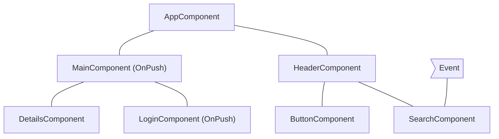
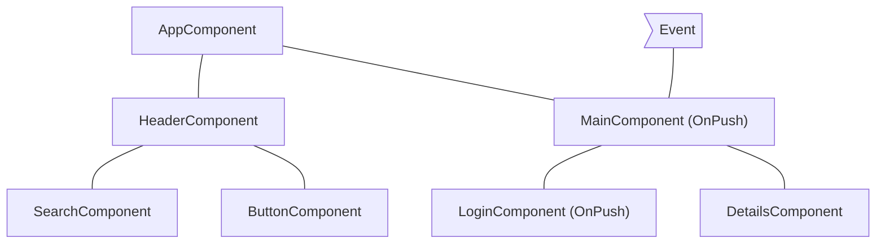
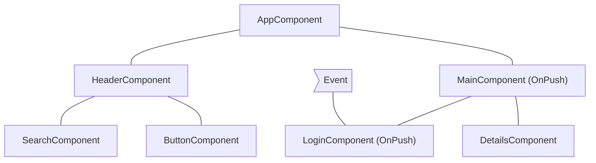
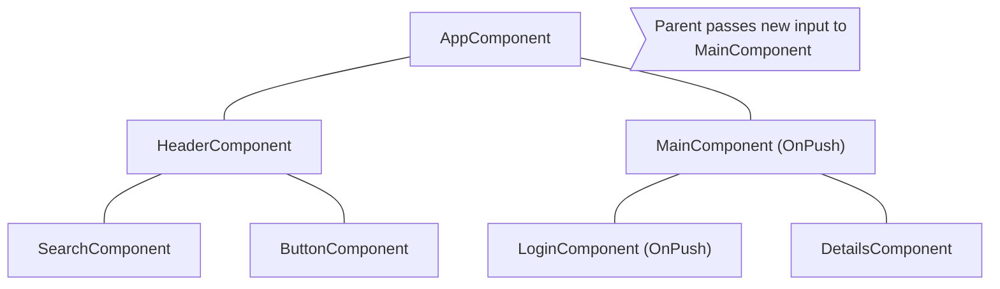

# Omitiendo subárboles de componentes

JavaScript, por defecto, usa estructuras de datos mutables que puedes referenciar desde múltiples componentes diferentes. Angular ejecuta change detection sobre todo tu árbol de componentes para asegurarse de que el estado más actualizado de tus estructuras de datos se refleje en el DOM.

El change detection es suficientemente rápido para la mayoría de las aplicaciones. Sin embargo, cuando una aplicación tiene un árbol de componentes especialmente grande, ejecutar change detection en toda la aplicación puede causar problemas de rendimiento. Puedes abordar esto configurando el change detection para que solo se ejecute en un subconjunto del árbol de componentes.

Si confías en que una parte de la aplicación no está afectada por un cambio de estado, puedes usar [OnPush](/api/core/ChangeDetectionStrategy) para omitir change detection en un subárbol completo de componentes.

## Usando `OnPush`

El change detection OnPush le indica a Angular que ejecute change detection para un subárbol de componentes **solo** cuando:

* El componente raíz del subárbol recibe nuevas entradas como resultado de un enlace de plantilla. Angular compara el valor actual y pasado de la entrada con `==`.
* Angular maneja un evento _(por ejemplo usando enlace de evento, enlace de salida, o `@HostListener`)_ en el componente raíz del subárbol o cualquiera de sus hijos, ya sea que estén usando change detection OnPush o no.

Puedes establecer la estrategia de change detection de un componente a `OnPush` en el decorador `@Component`:

```ts
import { ChangeDetectionStrategy, Component } from '@angular/core';
@Component({
  changeDetection: ChangeDetectionStrategy.OnPush,
})
export class MyComponent {}
```

## Escenarios comunes de change detection

Esta sección examina varios escenarios comunes de change detection para ilustrar el comportamiento de Angular.

### Un evento es manejado por un componente con change detection predeterminado

Si Angular maneja un evento dentro de un componente sin estrategia `OnPush`, el framework ejecuta change detection en todo el árbol de componentes. Angular omitirá subárboles de componentes descendientes con raíces usando `OnPush`, que no han recibido nuevas entradas.

Por ejemplo, si establecemos la estrategia de change detection de `MainComponent` a `OnPush` y el usuario interactúa con un componente fuera del subárbol con raíz `MainComponent`, Angular verificará todos los componentes rosa del diagrama de abajo (`AppComponent`, `HeaderComponent`, `SearchComponent`, `ButtonComponent`) a menos que `MainComponent` reciba nuevas entradas:



## Un evento es manejado por un componente con OnPush

Si Angular maneja un evento dentro de un componente con estrategia OnPush, el framework ejecutará change detection dentro de todo el árbol de componentes. Angular ignorará subárboles de componentes con raíces usando OnPush, que no han recibido nuevas entradas y están fuera del componente que manejó el evento.

Por ejemplo, si Angular maneja un evento dentro de `MainComponent`, el framework ejecutará change detection en todo el árbol de componentes. Angular ignorará el subárbol con raíz `LoginComponent` porque tiene `OnPush` y el evento ocurrió fuera de su alcance.



## Un evento es manejado por un descendiente de un componente con OnPush

Si Angular maneja un evento en un componente con OnPush, el framework ejecutará change detection en todo el árbol de componentes, incluidos los ancestros del componente.

Por ejemplo, en el diagrama de abajo, Angular maneja un evento en `LoginComponent` que usa OnPush. Angular invocará change detection en todo el subárbol de componentes incluyendo `MainComponent` (padre de `LoginComponent`), aunque `MainComponent` también tenga `OnPush`. Angular verifica `MainComponent` también porque `LoginComponent` es parte de su vista.



## Nuevas entradas a componente con OnPush

Angular ejecutará change detection dentro de un componente hijo con `OnPush` cuando se establece una propiedad de entrada como resultado de un enlace de plantilla.

Por ejemplo, en el diagrama de abajo, `AppComponent` pasa una nueva entrada a `MainComponent`, que tiene `OnPush`. Angular ejecutará change detection en `MainComponent` pero no ejecutará change detection en `LoginComponent`, que también tiene `OnPush`, a menos que reciba nuevas entradas también.



## Casos extremos

* **Modificar propiedades de entrada en código TypeScript**. Cuando usas una API como `@ViewChild` o `@ContentChild` para obtener una referencia a un componente en TypeScript y modificas manualmente una propiedad `@Input`, Angular no ejecutará automáticamente change detection para componentes OnPush. Si necesitas que Angular ejecute change detection, puedes inyectar `ChangeDetectorRef` en tu componente y llamar a `changeDetectorRef.markForCheck()` para indicarle a Angular que programe un change detection.
* **Modificar referencias de objetos**. En caso de que una entrada reciba un objeto mutable como valor y modifiques el objeto pero preserves la referencia, Angular no invocará change detection. Ese es el comportamiento esperado porque el valor anterior y el actual de la entrada apuntan a la misma referencia.
