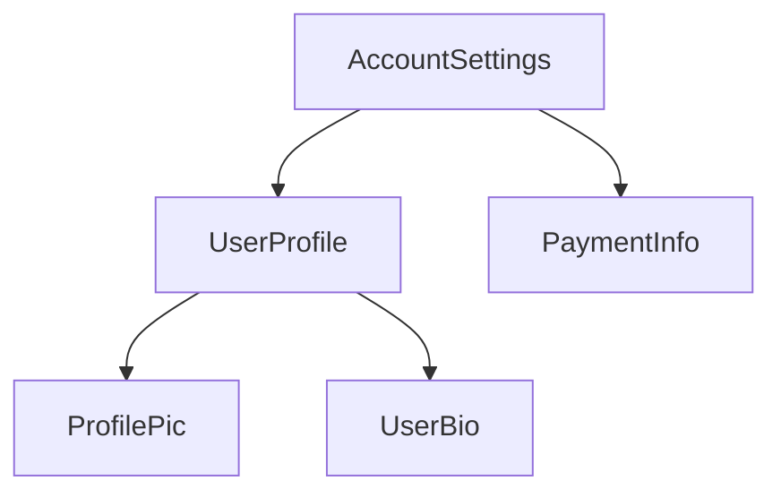

<docs-decorative-header title="Anatomía de un componente" imgSrc="adev/src/assets/images/components.svg"> <!-- markdownlint-disable-line -->
</docs-decorative-header>

SUGERENCIA: Esta guía asume que ya has leído [Guía de Esenciales](essentials). Lee eso primero si eres nuevo en Angular.

Cada componente debe tener:

* Una clase TypeScript con _comportamientos_ como el manejo de la entrada del usuario y la obtención de datos desde un servidor
* Una plantilla HTML que controla lo que se renderiza en el DOM
* Un [selector CSS](https://developer.mozilla.org/es/docs/Learn_web_development/Core/Styling_basics/Basic_selectors) que define cómo se utiliza el componente en el HTML

Puedes proporcionar información específica de Angular para un componente agregando un [decorador](https://www.typescriptlang.org/docs/handbook/decorators.html) `@Component` en la parte superior de la clase TypeScript:

<docs-code language="angular-ts" highlight="[1, 2, 3, 4]">
@Component({
  selector: 'profile-photo',
  template: ``,
})
export class ProfilePhoto { }
</docs-code>

Para más detalles sobre cómo escribir plantillas de Angular, consulte la [Guía de Plantillas](guide/templates).

El objeto pasado al decorador `@Component` se llama **metadatos** del componente. Esto incluye el `selector`, `template`, y otras propiedades descritas a lo largo de esta guía.

Los componentes pueden incluir opcionalmente una lista de estilos CSS que se aplican exclusivamente al DOM de ese componente.

<docs-code language="angular-ts" highlight="[4]">
@Component({
  selector: 'profile-photo',
  template: ``,
  styles: `img { border-radius: 50%; }`,
})
export class ProfilePhoto { }
</docs-code>

Por defecto, los estilos de un componente solo afectan a los elementos definidos en la plantilla de ese componente. Consulta [Estilos de Componentes](guide/components/styling) para detalles sobre el enfoque de Angular para el manejo de estilos

Alternativamente, puedes elegir por escribir su plantilla y estilos en archivos separados:

<docs-code language="angular-ts" highlight="[3, 4]">
@Component({
  selector: 'profile-photo',
  templateUrl: 'profile-photo.html',
  styleUrl: 'profile-photo.css',
})
export class ProfilePhoto { }
</docs-code>

Esto puede ayudar a separar las preocupaciones de _presentación_ del _comportamiento_ en tu proyecto. Puede elegir un enfoque para todo tu proyecto, o decidir cuál usar para cada componente.

Tanto `templateUrl` como `styleUrls` son relativos al directorio en el que reside el componente.

## Usar Componentes

### Imports in the `@Component` decorator

Para usar un component, [directive](guide/directives), o [pipe](guide/templates/pipes), debes agregarlo al arreglo de 
`imports` en el decorador `@Component`:

```angular-ts
import {ProfilePhoto} from './profile-photo';

@Component({
  // Importa el componente `ProfilePhoto` para
  // poder usarlo en la plantilla de este componente.
  imports: [ProfilePhoto],
  /* ... */
})
export class UserProfile { }
```

Por defecto, los componentes de Angular son *independientes* (standalone), lo que significa que puedes agregarlos directamente al arreglo `imports` de otros componentes. Los componentes creados con una versión anterior de Angular pueden especificar `standalone: false` en su decorador `@Component`. Para estos componentes, en su lugar importas el `NgModule` en el que está definido el componente. Consulta la [guía completa de `NgModule`](guide/ngmodules) para detalles.

Importante: En versiones de Angular anteriores a 19.0.0, la opción `standalone` por defecto es `false`.

### Mostrar componentes en una plantilla

Todo componente define un[CSS selector](https://developer.mozilla.org/es/docs/Learn_web_development/Core/Styling_basics/Basic_selectors):

<docs-code language="angular-ts" highlight="[2]">
@Component({
  selector: 'profile-photo',
  ...
})
export class ProfilePhoto { }
</docs-code>

Consulta [Selectores de Componentes](guide/components/selectors) para detalles sobre qué tipos de selectores soporta Angular y orientación sobre cómo elegir un selector.

Muestras un componente creando un elemento HTML coincidente en la plantilla de _otros_ componentes:

<docs-code language="angular-ts" highlight="[8]">
@Component({
  selector: 'profile-photo',
})
export class ProfilePhoto { }

@Component({
  imports: [ProfilePhoto],
  template: `<profile-photo />`
})
export class UserProfile { }
</docs-code>

Angular crea una instancia del componente para cada elemento HTML coincidente que encuentra. El elemento DOM que coincide con el selector de un componente se conoce como el **elemento host** de ese componente. El contenido de la plantilla de un componente se renderiza dentro de su elemento host.

El DOM renderizado por un componente, correspondiente a la plantilla de ese componente, se llama la 
**vista** de ese componente.

Al componer componentes de esta manera, **puedes pensar en tu aplicación Angular como un árbol de componentes**.




Esta estructura de árbol es importante para entender varios otros conceptos de Angular, incluyendo [inyección de dependencias](guide/di) y [consultas de componentes hijos](guide/components/queries).
