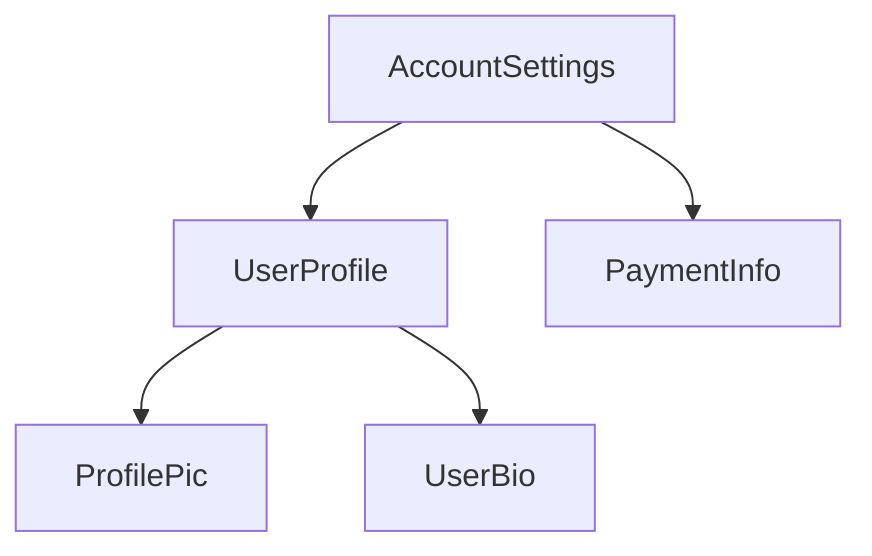

<docs-decorative-header title="Anatomía de Componentes" imgSrc="adev/src/assets/images/components.svg"> <!-- markdownlint-disable-line -->
</docs-decorative-header>

Sugerencia: Esta guía asume que ya has leído [Guía de Esenciales](essentials). Lee eso primero si eres nuevo en Angular.

Cada componente debe tener:

* Una clase TypeScript con _comportamientos_ como el manejo de la entrada del usuario y la obtención de datos desde un servidor
* Una plantilla HTML que controla lo que se renderiza en el DOM
* Un [selector CSS](https://developer.mozilla.org/en-US/docs/Learn/CSS/Building_blocks/Selectors) que define cómo se utiliza el componente en HTML

Usted proporciona información específica de Angular para un componente agregando un [decorador](https://www.typescriptlang.org/docs/handbook/decorators.html) `@Component` en la parte superior de la clase TypeScript:

<docs-code language="ts" highlight="[1, 2, 3, 4]">
@Component({
  selector: 'profile-photo',
  template: ``,
})
export class ProfilePhoto { }
</docs-code>

Para obtener más información sobre cómo escribir plantillas de Angular, consulte la [Guía de Plantillas](guide/templates).

El objeto pasado al decorador `@Component` se llama **metadatos** del componente. Éste incluye el `selector`, `template`, y otras propiedades descritas a lo largo de esta guía.

Los componentes pueden incluir opcionalmente una lista de estilos CSS que se aplican exclusivamente al DOM de ese componente.

<docs-code language="ts" highlight="[4]">
@Component({
  selector: 'profile-photo',
  template: ``,
  styles: `img { border-radius: 50%; }`,
})
export class ProfilePhoto { }
</docs-code>

Por defecto, los estilos de un componente solo afectan a los elementos definidos en la plantilla de ese componente. Consulte [Estilos de Componentes](guide/components/styling) para obtener detalles sobre el enfoque de Angular para el estilo.

Alternativamente, puede optar por escribir su plantilla y estilos en archivos separados:

<docs-code language="ts" highlight="[3, 4]">
@Component({
  selector: 'profile-photo',
  templateUrl: 'profile-photo.html',
  styleUrl: 'profile-photo.css',
})
export class ProfilePhoto { }
</docs-code>

Esto puede ayudar a separar las preocupaciones de la _presentación_ del _comportamiento_ en su proyecto. Puede elegir un enfoque para todo su proyecto, o decidir cuál usar para cada componente.

Tanto `templateUrl` como `styleUrls` son relativos al directorio en el que reside el componente.

## Usando Componentes

Cada componente define un [selector CSS](https://developer.mozilla.org/en-US/docs/Learn/CSS/Building_blocks/Selectors):

<docs-code language="ts" highlight="[2]">
@Component({
  selector: 'profile-photo',
  ...
})
export class ProfilePhoto { }
</docs-code>

Consulte [Selectores de Componentes](guide/components/selectors) para conocer más detalles sobre qué tipos de selectores soporta Angular y orientación para eleguir un selector.

Usa componente creando un elemento HTML correspondiente en la plantilla de _otros_ componentes.

<docs-code language="ts" highlight="[4]">
@Component({
  selector: 'user-profile',
  template: `
    <profile-photo />
    <button>Cargar una nueva foto de perfil</button>`,
  ...,
})
export class UserProfile { }
</docs-code>

Consulte [Importación y Uso de Componentes](guide/components/importing) para conocer más detalles sobre cómo referenciar y usar otros componentes en su template.

Angular crea una instancia del componente por cada elemento HTML coincidente que encuentre. El elemento DOM que coincide con el selector de un componente se conoce como el **elemento host** de ese componente. El contenido de la plantilla de un componente se renderiza dentro de su elemento host.

El DOM renderizado por un componente, correspondiente a la plantilla de ese componente, 
se denomina **vista** de ese componente.

Al componer componentes de esta manera, **puede pensar en su aplicación Angular como un árbol de componentes**.

```mermaid
flowchart TD
    A[AccountSettings]-->B
    A-->C
    B[UserProfile]-->D
    B-->E
    C[PaymentInfo]
    D[ProfilePic]
    E[UserBio]
```

Esta estructura en árbol es importante para comprender varios otros conceptos de Angular, incluyendo la [inyección de dependencias](guide/di) and [consultas de elementos secundarios](guide/components/queries).
