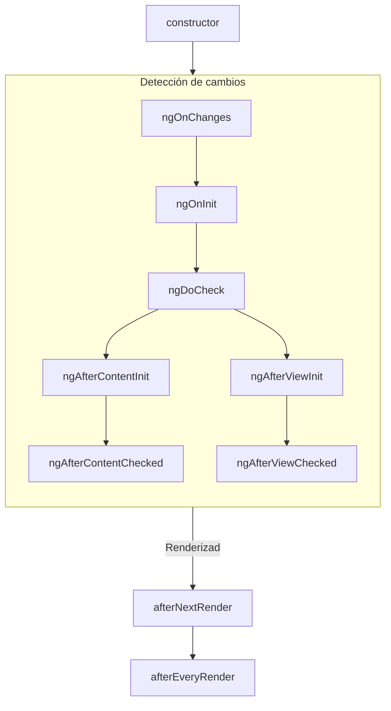
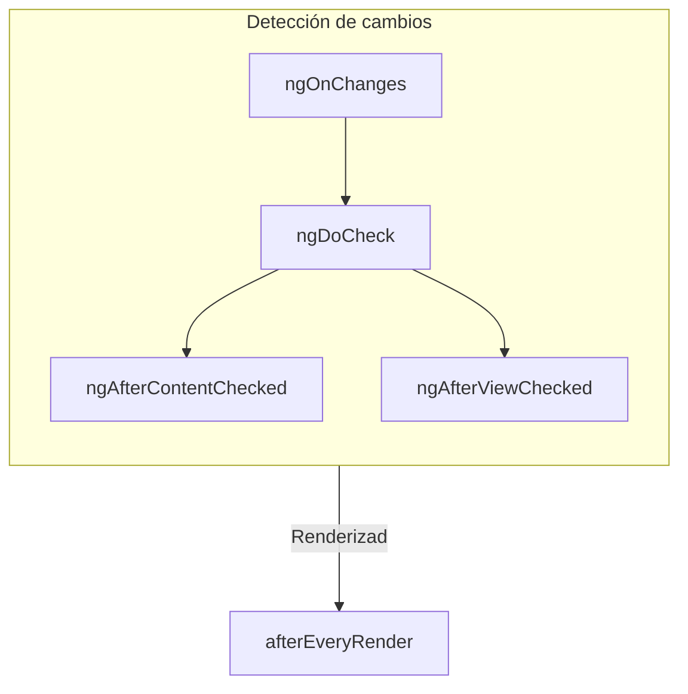

# Ciclo de vida del componente

CONSEJO: Esta guía asume que ya has leído la [Guía de Esenciales](essentials). Lee esa primero si eres nuevo en Angular.

El **ciclo de vida** de un componente es la secuencia de pasos que ocurren entre la creación del componente
y su destrucción. Cada paso representa una parte diferente del proceso de Angular para renderizar
componentes y verificar actualizaciones a lo largo del tiempo.

En tus componentes, puedes implementar **hooks de ciclo de vida** para ejecutar código durante estos pasos.
Los hooks de ciclo de vida que se relacionan con una instancia específica de componente se implementan como métodos en tu
clase de componente. Los hooks de ciclo de vida que se relacionan con la aplicación Angular en su conjunto se implementan
como funciones que aceptan un callback.

El ciclo de vida de un componente está estrechamente conectado con cómo Angular verifica los cambios en tus componentes a lo largo del
tiempo. Para entender este ciclo de vida, solo necesitas saber que Angular recorre
tu árbol de aplicación de arriba hacia abajo, verificando los enlaces de plantilla en busca de cambios. Los hooks de ciclo
de vida descritos a continuación se ejecutan mientras Angular realiza este recorrido. Este recorrido visita cada
componente exactamente una vez, por lo que siempre debes evitar hacer más cambios de estado en medio del
proceso.

## Resumen

<div class="docs-table docs-scroll-track-transparent">
  <table>
    <tr>
      <td><strong>Fase</strong></td>
      <td><strong>Método</strong></td>
      <td><strong>Resumen</strong></td>
    </tr>
    <tr>
      <td>Creación</td>
      <td><code>constructor</code></td>
      <td>
        <a href="https://developer.mozilla.org/es/docs/Web/JavaScript/Reference/Classes/constructor" target="_blank">
          Constructor de clase JavaScript estándar
        </a>. Se ejecuta cuando Angular instancia el componente.
      </td>
    </tr>
    <tr>
      <td rowspan="7">Detección de<p>cambios</td>
      <td><code>ngOnInit</code>
      </td>
      <td>Se ejecuta una vez después de que Angular ha inicializado todos los inputs del componente.</td>
    </tr>
    <tr>
      <td><code>ngOnChanges</code></td>
      <td>Se ejecuta cada vez que los inputs del componente han cambiado.</td>
    </tr>
    <tr>
      <td><code>ngDoCheck</code></td>
      <td>Se ejecuta cada vez que este componente es verificado en busca de cambios.</td>
    </tr>
    <tr>
      <td><code>ngAfterContentInit</code></td>
      <td>Se ejecuta una vez después de que el <em>contenido</em> del componente ha sido inicializado.</td>
    </tr>
    <tr>
      <td><code>ngAfterContentChecked</code></td>
      <td>Se ejecuta cada vez que el contenido de este componente ha sido verificado en busca de cambios.</td>
    </tr>
    <tr>
      <td><code>ngAfterViewInit</code></td>
      <td>Se ejecuta una vez después de que la <em>vista</em> del componente ha sido inicializada.</td>
    </tr>
    <tr>
      <td><code>ngAfterViewChecked</code></td>
      <td>Se ejecuta cada vez que la vista del componente ha sido verificada en busca de cambios.</td>
    </tr>
    <tr>
      <td rowspan="2">Renderizado</td>
      <td><code>afterNextRender</code></td>
      <td>Se ejecuta una vez la próxima vez que <strong>todos</strong> los componentes han sido renderizados en el DOM.</td>
    </tr>
    <tr>
      <td><code>afterEveryRender</code></td>
      <td>Se ejecuta cada vez que <strong>todos</strong> los componentes han sido renderizados en el DOM.</td>
    </tr>
    <tr>
      <td>Destrucción</td>
      <td><code>ngOnDestroy</code></td>
      <td>Se ejecuta una vez antes de que el componente sea destruido.</td>
    </tr>
  </table>
</div>

### ngOnInit

El método `ngOnInit` se ejecuta después de que Angular ha inicializado todos los inputs del componente con sus
valores iniciales. El `ngOnInit` de un componente se ejecuta exactamente una vez.

Este paso ocurre _antes_ de que la propia plantilla del componente sea inicializada. Esto significa que puedes
actualizar el estado del componente basándote en sus valores de input iniciales.

### ngOnChanges

El método `ngOnChanges` se ejecuta después de que cualquier input del componente ha cambiado.

Este paso ocurre _antes_ de que la propia plantilla del componente sea verificada. Esto significa que puedes actualizar
el estado del componente basándote en sus valores de input iniciales.

Durante la inicialización, el primer `ngOnChanges` se ejecuta antes de `ngOnInit`.

#### Inspeccionar cambios

El método `ngOnChanges` acepta un argumento `SimpleChanges`. Este objeto es
un [`Record`](https://www.typescriptlang.org/docs/handbook/utility-types.html#recordkeys-type)
que mapea cada nombre de input del componente a un objeto `SimpleChange`. Cada `SimpleChange` contiene el
valor anterior del input, su valor actual, y una bandera que indica si esta es la primera vez que el input
ha cambiado.

Opcionalmente puedes pasar la clase actual o this como el primer argumento genérico para una verificación de tipos más fuerte.

```ts
@Component({
  /* ... */
})
export class UserProfile {
  name = input('');

  ngOnChanges(changes: SimpleChanges<UserProfile>) {
    if (changes.name) {
      console.log(`Anterior: ${changes.name.previousValue}`);
      console.log(`Actual: ${changes.name.currentValue}`);
      console.log(`Es el primero: ${changes.name.firstChange}`);
    }
  }
}
```

Si proporcionas un `alias` para cualquier propiedad de input, el Record `SimpleChanges` todavía usa el
nombre de la propiedad TypeScript como clave, en lugar del alias.

### ngOnDestroy

El método `ngOnDestroy` se ejecuta una vez justo antes de que un componente sea destruido. Angular destruye un
componente cuando ya no se muestra en la página, como cuando es ocultado por `@if` o al navegar
a otra página.

#### DestroyRef

Como alternativa al método `ngOnDestroy`, puedes inyectar una instancia de `DestroyRef`. Puedes
registrar un callback para ser invocado en la destrucción del componente llamando al método `onDestroy`
de `DestroyRef`.

```ts
@Component({
  /* ... */
})
export class UserProfile {
  constructor() {
    inject(DestroyRef).onDestroy(() => {
      console.log('Destrucción de UserProfile');
    });
  }
}
```

Puedes pasar la instancia de `DestroyRef` a funciones o clases fuera de tu componente. Usa este
patrón si tienes otro código que debe ejecutar algún comportamiento de limpieza cuando el componente es
destruido.

También puedes usar `DestroyRef` para mantener el código de configuración cerca del código de limpieza, en lugar de poner
todo el código de limpieza en el método `ngOnDestroy`.

##### Detectar destrucción de instancia

`DestroyRef` proporciona una propiedad `destroyed` que permite verificar si una instancia dada ya ha sido destruida. Esto es útil para evitar operaciones en componentes destruidos, especialmente cuando se trata de lógica retrasada o asíncrona.

Al verificar `destroyRef.destroyed`, puedes prevenir la ejecución de código después de que la instancia ha sido limpiada, evitando errores potenciales como `NG0911: View has already been destroyed.`.

### ngDoCheck

El método `ngDoCheck` se ejecuta antes de cada vez que Angular verifica la plantilla de un componente en busca de cambios.

Puedes usar este hook de ciclo de vida para verificar manualmente cambios de estado fuera de la detección normal de
cambios de Angular, actualizando manualmente el estado del componente.

Este método se ejecuta muy frecuentemente y puede impactar significativamente el rendimiento de tu página. Evita
definir este hook siempre que sea posible, usándolo solo cuando no tengas alternativa.

Durante la inicialización, el primer `ngDoCheck` se ejecuta después de `ngOnInit`.

### ngAfterContentInit

El método `ngAfterContentInit` se ejecuta una vez después de que todos los hijos anidados dentro del componente (su
_contenido_) han sido inicializados.

Puedes usar este hook de ciclo de vida para leer los resultados de las
[consultas de contenido](guide/components/queries#content-queries). Aunque puedes acceder al estado inicializado
de estas consultas, intentar cambiar cualquier estado en este método resulta en un
[ExpressionChangedAfterItHasBeenCheckedError](errors/NG0100)

### ngAfterContentChecked

El método `ngAfterContentChecked` se ejecuta cada vez que los hijos anidados dentro del componente (su
_contenido_) han sido verificados en busca de cambios.

Este método se ejecuta muy frecuentemente y puede impactar significativamente el rendimiento de tu página. Evita
definir este hook siempre que sea posible, usándolo solo cuando no tengas alternativa.

Aunque puedes acceder al estado actualizado
de las [consultas de contenido](guide/components/queries#content-queries) aquí, intentar
cambiar cualquier estado en este método resulta en
un [ExpressionChangedAfterItHasBeenCheckedError](errors/NG0100).

### ngAfterViewInit

El método `ngAfterViewInit` se ejecuta una vez después de que todos los hijos en la plantilla del componente (su
_vista_) han sido inicializados.

Puedes usar este hook de ciclo de vida para leer los resultados de las
[consultas de vista](guide/components/queries#view-queries). Aunque puedes acceder al estado inicializado de
estas consultas, intentar cambiar cualquier estado en este método resulta en un
[ExpressionChangedAfterItHasBeenCheckedError](errors/NG0100)

### ngAfterViewChecked

El método `ngAfterViewChecked` se ejecuta cada vez que los hijos en la plantilla del componente (su
_vista_) han sido verificados en busca de cambios.

Este método se ejecuta muy frecuentemente y puede impactar significativamente el rendimiento de tu página. Evita
definir este hook siempre que sea posible, usándolo solo cuando no tengas alternativa.

Aunque puedes acceder al estado actualizado de las [consultas de vista](guide/components/queries#view-queries)
aquí, intentar
cambiar cualquier estado en este método resulta en
un [ExpressionChangedAfterItHasBeenCheckedError](errors/NG0100).

### afterEveryRender y afterNextRender

Las funciones `afterEveryRender` y `afterNextRender` te permiten registrar un **callback de renderizado** para ser
invocado después de que Angular ha terminado de renderizar _todos los componentes_ en la página en el DOM.

Estas funciones son diferentes de los otros hooks de ciclo de vida descritos en esta guía. En lugar de un
método de clase, son funciones standalone que aceptan un callback. La ejecución de los callbacks de renderizado
no está vinculada a ninguna instancia específica de componente, sino que es un hook a nivel de aplicación.

`afterEveryRender` y `afterNextRender` deben ser llamados en
un [contexto de inyección](guide/di/dependency-injection-context), típicamente el
constructor de un componente.

Puedes usar callbacks de renderizado para realizar operaciones manuales del DOM.
Consulta [Usar APIs del DOM](guide/components/dom-apis) para orientación sobre trabajar con el DOM en Angular.

Los callbacks de renderizado no se ejecutan durante el renderizado del lado del servidor o durante el pre-renderizado en tiempo de compilación.

#### Fases de after\*Render

Al usar `afterEveryRender` o `afterNextRender`, opcionalmente puedes dividir el trabajo en fases. La
fase te da control sobre la secuenciación de operaciones del DOM, permitiéndote secuenciar operaciones de _escritura_
antes de operaciones de _lectura_ para minimizar el
[layout thrashing](https://web.dev/avoid-large-complex-layouts-and-layout-thrashing). Para
comunicarse entre fases, una función de fase puede devolver un valor de resultado que puede ser accedido en la
siguiente fase.

```ts
import {Component, ElementRef, afterNextRender} from '@angular/core';

@Component({...})
export class UserProfile {
  private prevPadding = 0;
  private elementHeight = 0;

  constructor() {
    private elementRef = inject(ElementRef);
    const nativeElement = elementRef.nativeElement;

    afterNextRender({
      // Usa la fase `Write` para escribir a una propiedad geométrica.
      write: () => {
        const padding = computePadding();
        const changed = padding !== this.prevPadding;
        if (changed) {
          nativeElement.style.padding = padding;
        }
        return changed; // Comunica si algo cambió a la fase read.
      },

      // Usa la fase `Read` para leer propiedades geométricas después de que todas las escrituras hayan ocurrido.
      read: (didWrite) => {
        if (didWrite) {
          this.elementHeight = nativeElement.getBoundingClientRect().height;
        }
      }
    });
  }
}
```

Hay cuatro fases, ejecutadas en el siguiente orden:

| Fase             | Descripción                                                                                                                                                                                           |
| ---------------- | ----------------------------------------------------------------------------------------------------------------------------------------------------------------------------------------------------- |
| `earlyRead`      | Usa esta fase para leer cualquier propiedad y estilo del DOM que afecte el layout y que sea estrictamente necesario para cálculos posteriores. Evita esta fase si es posible, prefiriendo las fases `write` y `read`. |
| `write`          | Usa esta fase para escribir propiedades y estilos del DOM que afecten el layout.                                                                                                                       |
| `mixedReadWrite` | Fase predeterminada. Usa para cualquier operación que necesite tanto leer como escribir propiedades y estilos que afecten el layout. Evita esta fase si es posible, prefiriendo las fases explícitas `write` y `read`. |
| `read`           | Usa esta fase para leer cualquier propiedad del DOM que afecte el layout.                                                                                                                              |

## Interfaces de ciclo de vida

Angular proporciona una interfaz TypeScript para cada método de ciclo de vida. Opcionalmente puedes importar
e `implementar` estas interfaces para asegurar que tu implementación no tenga errores tipográficos o
de ortografía.

Cada interfaz tiene el mismo nombre que el método correspondiente sin el prefijo `ng`. Por ejemplo,
la interfaz para `ngOnInit` es `OnInit`.

```ts
@Component({
  /* ... */
})
export class UserProfile implements OnInit {
  ngOnInit() {
    /* ... */
  }
}
```

## Orden de ejecución

Los siguientes diagramas muestran el orden de ejecución de los hooks de ciclo de vida de Angular.

### Durante la inicialización



### Actualizaciones posteriores



### Orden con directivas

Cuando pones una o más directivas en el mismo elemento que un componente, ya sea en una plantilla o con
la propiedad `hostDirectives`, el framework no garantiza ningún orden de un hook de ciclo de vida
dado entre el componente y las directivas en un solo elemento. Nunca dependas de un orden
observado, ya que esto puede cambiar en versiones posteriores de Angular.
