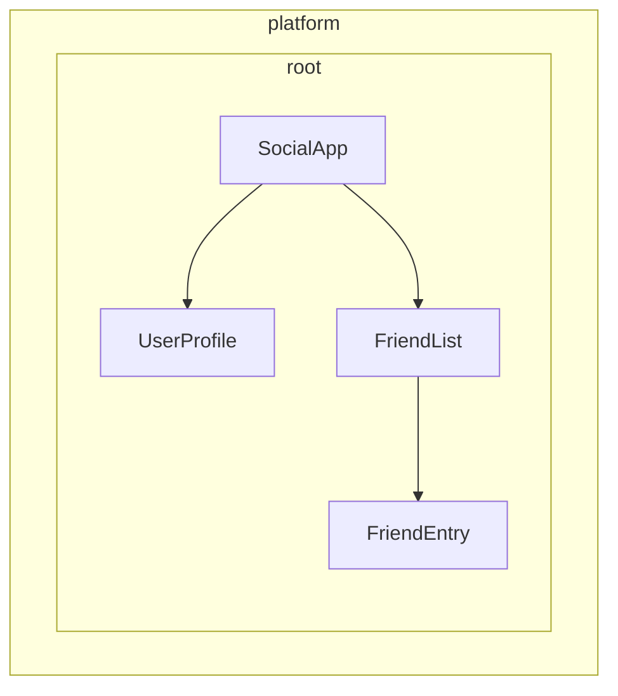

# Definiendo proveedores de dependencias

Angular proporciona dos formas de hacer que los servicios estén disponibles para inyección:

1. **Provisión automática** - Usando `providedIn` en el decorador `@Injectable` o proporcionando un factory en la configuración de `InjectionToken`
2. **Provisión manual** - Usando el array `providers` en componentes, directivas, rutas o configuración de la aplicación

En la [guía anterior](/guide/di/creating-and-using-services), aprendiste cómo crear servicios usando `providedIn: 'root'`, lo cual maneja la mayoría de los casos de uso comunes. Esta guía explora patrones adicionales para la configuración de proveedores tanto automática como manual.

## Provisión automática para dependencias que no son clases

Mientras que el decorador `@Injectable` con `providedIn: 'root'` funciona muy bien para servicios (clases), podrías necesitar proveer otros tipos de valores globalmente — como objetos de configuración, funciones o valores primitivos. Angular proporciona `InjectionToken` para este propósito.

### ¿Qué es un InjectionToken?

Un `InjectionToken` es un objeto que el sistema de inyección de dependencias en Angular usa para identificar valores de forma única para la inyección. Piensa en él como una clave especial que te permite almacenar y recuperar cualquier tipo de valor en el sistema de DI en Angular:

```ts
import { InjectionToken } from '@angular/core';

// Crea un token para un valor de tipo string
export const API_URL = new InjectionToken<string>('api.url');

// Crea un token para una función
export const LOGGER = new InjectionToken<(msg: string) => void>('logger.function');

// Crea un token para un tipo complejo
export interface Config {
  apiUrl: string;
  timeout: number;
}
export const CONFIG_TOKEN = new InjectionToken<Config>('app.config');
```

NOTA: El parámetro string (por ejemplo, `'api.url'`) es una descripción puramente para depuración — Angular identifica los tokens por su referencia de objeto, no por este string.

### InjectionToken con `providedIn: 'root'`

Un `InjectionToken` que tiene un `factory` resulta en `providedIn: 'root'` por defecto (pero puede ser sobrescrito a través de la propiedad `providedIn`).

```ts
// 📁 /app/config.token.ts
import { InjectionToken } from '@angular/core';

export interface AppConfig {
  apiUrl: string;
  version: string;
  features: Record<string, boolean>;
}

// Configuración disponible globalmente usando providedIn
export const APP_CONFIG = new InjectionToken<AppConfig>('app.config', {
  providedIn: 'root',
  factory: () => ({
    apiUrl: 'https://api.example.com',
    version: '1.0.0',
    features: {
      darkMode: true,
      analytics: false
    }
  })
});

// No es necesario agregar al array de providers - ¡disponible en todas partes!
@Component({
  selector: 'app-header',
  template: `<h1>Version: {{ config.version }}</h1>`
})
export class HeaderComponent {
  config = inject(APP_CONFIG); // Disponible automáticamente
}
```

### Cuándo usar InjectionToken con funciones factory

`InjectionToken` con funciones factory es ideal cuando no puedes usar una clase pero necesitas proveer dependencias globalmente:

```ts
// 📁 /app/logger.token.ts
import { InjectionToken, inject } from '@angular/core';
import { APP_CONFIG } from './config.token';

// Tipo de función de logger
export type LoggerFn = (level: string, message: string) => void;

// Función de logger global con dependencias
export const LOGGER_FN = new InjectionToken<LoggerFn>('logger.function', {
  providedIn: 'root',
  factory: () => {
    const config = inject(APP_CONFIG);

    return (level: string, message: string) => {
      if (config.features.logging !== false) {
        console[level](`[${new Date().toISOString()}] ${message}`);
      }
    };
  }
});

// 📁 /app/storage.token.ts
// Proporcionando APIs del navegador como tokens
export const LOCAL_STORAGE = new InjectionToken<Storage>('localStorage', {
  // providedIn: 'root' está configurado como valor predeterminado
  factory: () => window.localStorage
});

export const SESSION_STORAGE = new InjectionToken<Storage>('sessionStorage', {
  providedIn: 'root',
  factory: () => window.sessionStorage
});

// 📁 /app/feature-flags.token.ts
// Configuración compleja con lógica en tiempo de ejecución
export const FEATURE_FLAGS = new InjectionToken<Map<string, boolean>>('feature.flags', {
  providedIn: 'root',
  factory: () => {
    const flags = new Map<string, boolean>();

    // Parsear desde el entorno o parámetros de URL
    const urlParams = new URLSearchParams(window.location.search);
    const enableBeta = urlParams.get('beta') === 'true';

    flags.set('betaFeatures', enableBeta);
    flags.set('darkMode', true);
    flags.set('newDashboard', false);

    return flags;
  }
});
```

Este enfoque ofrece varias ventajas:

- **No se necesita configuración manual de proveedores** - Funciona igual que `providedIn: 'root'` para servicios
- **Tree-shakeable** - Solo se incluye si realmente se usa
- **Seguro en tipos** - Soporte completo de TypeScript para valores que no son clases
- **Puede inyectar otras dependencias** - Las funciones factory pueden usar `inject()` para acceder a otros servicios

## Entendiendo la configuración manual de proveedores

Cuando necesitas más control del que ofrece `providedIn: 'root'`, puedes configurar proveedores manualmente. La configuración manual a través del array `providers` es útil cuando:

1. **El servicio no tiene `providedIn`** - Los servicios sin provisión automática deben ser proporcionados manualmente
2. **Quieres una nueva instancia** - Para crear una instancia separada a nivel de componente/directiva en lugar de usar la compartida
3. **Necesitas configuración en tiempo de ejecución** - Cuando el comportamiento del servicio depende de valores en tiempo de ejecución
4. **Estás proporcionando valores que no son clases** - Objetos de configuración, funciones o valores primitivos

### Ejemplo: Servicio sin `providedIn`

```ts
import { Injectable, Component, inject } from '@angular/core';

// Servicio sin providedIn
@Injectable()
export class LocalDataStore {
  private data: string[] = [];

  addData(item: string) {
    this.data.push(item);
  }
}

// El componente debe proporcionarlo
@Component({
  selector: 'app-example',
  // Se requiere un proveedor aquí porque el servicio `LocalDataStore` no tiene providedIn.
  providers: [LocalDataStore],
  template: `...`
})
export class ExampleComponent {
  dataStore = inject(LocalDataStore);
}
```

### Ejemplo: Creando instancias específicas de componente

Los servicios con `providedIn: 'root'` pueden ser sobrescritos a nivel de componente. Esto vincula la instancia del servicio al ciclo de vida de un componente. Como resultado, cuando el componente se destruye, el servicio proporcionado también se destruye.

```ts
import { Injectable, Component, inject } from '@angular/core';

@Injectable({ providedIn: 'root' })
export class DataStore {
  private data: ListItem[] = [];
}

// Este componente obtiene su propia instancia
@Component({
  selector: 'app-isolated',
  // Crea una nueva instancia de `DataStore` en lugar de usar la instancia proporcionada en root.
  providers: [DataStore],
  template: `...`
})
export class IsolatedComponent {
  dataStore = inject(DataStore); // Instancia específica del componente
}
```

## Jerarquía de inyectores en Angular

El sistema de inyección de dependencias en Angular es jerárquico. Cuando un componente solicita una dependencia, Angular comienza con el inyector de ese componente y recorre el árbol hacia arriba hasta encontrar un proveedor para esa dependencia. Cada componente en el árbol de tu aplicación puede tener su propio inyector, y estos inyectores forman una jerarquía que refleja tu árbol de componentes.

Esta jerarquía permite:

- **Instancias con alcance**: Diferentes partes de tu aplicación pueden tener diferentes instancias del mismo servicio
- **Comportamiento de sobrescritura**: Los componentes hijos pueden sobrescribir proveedores de los componentes padres
- **Eficiencia de memoria**: Los servicios solo se instancian donde se necesitan

En Angular, cualquier elemento con un componente o directiva puede proveer valores a todos sus descendientes.



En el ejemplo anterior:

1. `SocialApp` puede proveer valores para `UserProfile` y `FriendList`
2. `FriendList` puede proveer valores para inyección a `FriendEntry`, pero no puede proveer valores para inyección en `UserProfile` porque no es parte del árbol

## Declarando un proveedor

Piensa en el sistema de inyección de dependencias en Angular como un hash map o diccionario. Cada objeto de configuración de proveedor define un par clave-valor:

- **Clave (Identificador de proveedor)**: El identificador único que usas para solicitar una dependencia
- **Valor**: Lo que Angular debe retornar cuando ese token es solicitado

Cuando proporcionas dependencias manualmente, típicamente ves esta sintaxis abreviada:

```angular-ts
import { Component } from '@angular/core';
import { LocalService } from './local-service';

@Component({
  selector: 'app-example',
  providers: [LocalService]  // Servicio sin providedIn
})
export class ExampleComponent { }
```

Esto es en realidad una forma abreviada de una configuración de proveedor más detallada:

```ts
{
  // Esta es la versión abreviada
  providers: [LocalService],

  // Esta es la versión completa
  providers: [
    { provide: LocalService, useClass: LocalService }
  ]
}
```

### Objeto de configuración del proveedor

Cada objeto de configuración de proveedor tiene dos partes principales:

1. **Identificador del proveedor**: La clave única que Angular usa para obtener la dependencia (establecida a través de la propiedad `provide`)
2. **Valor**: La dependencia real que quieres que Angular obtenga, configurada con diferentes claves según el tipo deseado:
   - `useClass` - Proporciona una clase JavaScript
   - `useValue` - Proporciona un valor estático
   - `useFactory` - Proporciona una función factory que retorna el valor
   - `useExisting` - Proporciona un alias a un proveedor existente

### Identificadores de proveedores

Los identificadores de proveedores permiten al sistema de inyección de dependencias (DI) en Angular recuperar una dependencia a través de un ID único. Puedes generar identificadores de proveedores de dos formas:

1. [Nombres de clases](#nombres-de-clases)
2. [Tokens de inyección](#tokens-de-inyección)

#### Nombres de clases

Los nombres de clases usan la clase importada directamente como identificador:

```angular-ts
import { Component } from '@angular/core';
import { LocalService } from './local-service';

@Component({
  selector: 'app-example',
  providers: [
    { provide: LocalService, useClass: LocalService }
  ]
})
export class ExampleComponent { /* ... */ }
```

La clase sirve tanto como identificador como implementación, por lo cual Angular proporciona la forma abreviada `providers: [LocalService]`.

#### Tokens de inyección

Angular proporciona una clase integrada [`InjectionToken`](api/core/InjectionToken) que crea una referencia de objeto única para valores inyectables o cuando quieres proveer múltiples implementaciones de la misma interfaz.

```ts
// �� /app/tokens.ts
import { InjectionToken } from '@angular/core';
import { DataService } from './data-service.interface';

export const DATA_SERVICE_TOKEN = new InjectionToken<DataService>('DataService');
```

NOTA: El string `'DataService'` es una descripción usada puramente para fines de depuración. Angular identifica el token por su referencia de objeto, no por este string.

Usa el token en la configuración de tu proveedor:

```angular-ts
import { Component, inject } from '@angular/core';
import { LocalDataService } from './local-data-service';
import { DATA_SERVICE_TOKEN } from './tokens';

@Component({
  selector: 'app-example',
  providers: [
    { provide: DATA_SERVICE_TOKEN, useClass: LocalDataService }
  ]
})
export class ExampleComponent {
  private dataService = inject(DATA_SERVICE_TOKEN);
}
```

#### ¿Pueden las interfaces de TypeScript ser identificadores para inyección?

Las interfaces de TypeScript no pueden usarse para inyección porque no existen en tiempo de ejecución:

```ts
// ❌ ¡Esto no funcionará!
interface DataService {
  getData(): string[];
}

// Las interfaces desaparecen después de la compilación de TypeScript
@Component({
  providers: [
    { provide: DataService, useClass: LocalDataService } // ¡Error!
  ]
})
export class ExampleComponent {
  private dataService = inject(DataService); // ¡Error!
}

// ✅ Usa InjectionToken en su lugar
export const DATA_SERVICE_TOKEN = new InjectionToken<DataService>('DataService');

@Component({
  providers: [
    { provide: DATA_SERVICE_TOKEN, useClass: LocalDataService }
  ]
})
export class ExampleComponent {
  private dataService = inject(DATA_SERVICE_TOKEN); // ¡Funciona!
}
```

El `InjectionToken` proporciona un valor en tiempo de ejecución que el sistema de DI en Angular puede usar, mientras mantiene la seguridad de tipos a través del parámetro de tipo genérico de TypeScript.

### Tipos de valores de proveedores

#### useClass

`useClass` proporciona una clase JavaScript como dependencia. Este es el valor predeterminado cuando se usa la sintaxis abreviada:

```ts
// Abreviada
providers: [DataService]

// Sintaxis completa
providers: [
  { provide: DataService, useClass: DataService }
]

// Implementación diferente
providers: [
  { provide: DataService, useClass: MockDataService }
]

// Implementación condicional
providers: [
  {
    provide: StorageService,
    useClass: environment.production ? CloudStorageService : LocalStorageService
  }
]
```

#### Ejemplo práctico: Sustitución de Logger

Puedes sustituir implementaciones para extender funcionalidad:

```ts
import { Injectable, Component, inject } from '@angular/core';

// Logger base
@Injectable()
export class Logger {
  log(message: string) {
    console.log(message);
  }
}

// Logger mejorado con marca de tiempo
@Injectable()
export class BetterLogger extends Logger {
  override log(message: string) {
    super.log(`[${new Date().toISOString()}] ${message}`);
  }
}

// Logger que incluye contexto de usuario
@Injectable()
export class EvenBetterLogger extends Logger {
  private userService = inject(UserService);

  override log(message: string) {
    const name = this.userService.user.name;
    super.log(`Message to ${name}: ${message}`);
  }
}

// En tu componente
@Component({
  selector: 'app-example',
  providers: [
    UserService, // EvenBetterLogger necesita esto
    { provide: Logger, useClass: EvenBetterLogger }
  ]
})
export class ExampleComponent {
  private logger = inject(Logger); // Obtiene una instancia de EvenBetterLogger
}
```

#### useValue

`useValue` proporciona cualquier tipo de datos JavaScript como un valor estático:

```ts
providers: [
  { provide: API_URL_TOKEN, useValue: 'https://api.example.com' },
  { provide: MAX_RETRIES_TOKEN, useValue: 3 },
  { provide: FEATURE_FLAGS_TOKEN, useValue: { darkMode: true, beta: false } }
]
```

IMPORTANTE: Los tipos e interfaces de TypeScript no pueden servir como valores de dependencia. Solo existen en tiempo de compilación.

#### Ejemplo práctico: Configuración de la aplicación

Un caso de uso común para `useValue` es proveer configuración de la aplicación:

```ts
// Definir interfaz de configuración
export interface AppConfig {
  apiUrl: string;
  appTitle: string;
  features: {
    darkMode: boolean;
    analytics: boolean;
  };
}

// Crear token de inyección
export const APP_CONFIG = new InjectionToken<AppConfig>('app.config');

// Definir configuración
const appConfig: AppConfig = {
  apiUrl: 'https://api.example.com',
  appTitle: 'My Application',
  features: {
    darkMode: true,
    analytics: false
  }
};

// Proveer en bootstrap
bootstrapApplication(AppComponent, {
  providers: [
    { provide: APP_CONFIG, useValue: appConfig }
  ]
});

// Usar en componente
@Component({
  selector: 'app-header',
  template: `<h1>{{ title }}</h1>`
})
export class HeaderComponent {
  private config = inject(APP_CONFIG);
  title = this.config.appTitle;
}
```

#### useFactory

`useFactory` proporciona una función que genera un nuevo valor para inyección:

```ts
export const loggerFactory = (config: AppConfig) => {
  return new LoggerService(config.logLevel, config.endpoint);
};

providers: [
  {
    provide: LoggerService,
    useFactory: loggerFactory,
    deps: [APP_CONFIG]  // Dependencias para la función factory
  }
]
```

Puedes marcar las dependencias del factory como opcionales:

```ts
import { Optional } from '@angular/core';

providers: [
  {
    provide: MyService,
    useFactory: (required: RequiredService, optional?: OptionalService) => {
      return new MyService(required, optional || new DefaultService());
    },
    deps: [RequiredService, [new Optional(), OptionalService]]
  }
]
```

#### Ejemplo práctico: Cliente API basado en configuración

Aquí hay un ejemplo completo que muestra cómo usar un factory para crear un servicio con configuración en tiempo de ejecución:

```ts
// Servicio que necesita configuración en tiempo de ejecución
class ApiClient {
  constructor(
    private http: HttpClient,
    private baseUrl: string,
    private rateLimitMs: number
  ) {}

  async fetchData(endpoint: string) {
    // Aplicar limitación de tasa basada en el nivel del usuario
    await this.applyRateLimit();
    return this.http.get(`${this.baseUrl}/${endpoint}`);
  }

  private async applyRateLimit() {
    // Ejemplo simplificado - la implementación real rastrearía el tiempo de las peticiones
    return new Promise(resolve => setTimeout(resolve, this.rateLimitMs));
  }
}

// Función factory que configura según el nivel del usuario
import { inject } from '@angular/core';
import { HttpClient } from '@angular/common/http';
const apiClientFactory = () => {
  const http = inject(HttpClient);
  const userService = inject(UserService);

  // Asumiendo que userService proporciona estos valores
  const baseUrl = userService.getApiBaseUrl();
  const rateLimitMs = userService.getRateLimit();

  return new ApiClient(http, baseUrl, rateLimitMs);
};

// Configuración del proveedor
export const apiClientProvider = {
  provide: ApiClient,
  useFactory: apiClientFactory
};

// Uso en componente
@Component({
  selector: 'app-dashboard',
  providers: [apiClientProvider]
})
export class DashboardComponent {
  private apiClient = inject(ApiClient);
}
```

#### useExisting

`useExisting` crea un alias para un proveedor que ya fue definido. Ambos tokens retornan la misma instancia:

```ts
providers: [
  NewLogger,  // El servicio real
  { provide: OldLogger, useExisting: NewLogger }  // El alias
]
```

IMPORTANTE: No confundas `useExisting` con `useClass`. `useClass` crea instancias separadas, mientras que `useExisting` asegura que obtienes la misma instancia singleton.

### Múltiples proveedores

Usa la bandera `multi: true` cuando múltiples proveedores contribuyen valores al mismo token:

```ts
export const INTERCEPTOR_TOKEN = new InjectionToken<Interceptor[]>('interceptors');

providers: [
  { provide: INTERCEPTOR_TOKEN, useClass: AuthInterceptor, multi: true },
  { provide: INTERCEPTOR_TOKEN, useClass: LoggingInterceptor, multi: true },
  { provide: INTERCEPTOR_TOKEN, useClass: RetryInterceptor, multi: true }
]
```

Cuando inyectas `INTERCEPTOR_TOKEN`, recibirás un array conteniendo instancias de los tres interceptors.

## ¿Dónde puedes especificar proveedores?

Angular ofrece varios niveles donde puedes registrar proveedores, cada uno con diferentes implicaciones para el alcance, ciclo de vida y rendimiento:

- [**Bootstrap de la aplicación**](#bootstrap-de-la-aplicación) - Singletons globales disponibles en todas partes
- [**En un elemento (componente o directiva)**](#proveedores-de-componente-o-directiva) - Instancias aisladas para árboles de componentes específicos
- [**Ruta**](#proveedores-de-ruta) - Servicios específicos de funcionalidad para módulos con lazy loading

### Bootstrap de la aplicación

Usa proveedores a nivel de aplicación en `bootstrapApplication` cuando:

- **El servicio se usa en múltiples áreas de funcionalidad** - Servicios como clientes HTTP, logging o autenticación que muchas partes de tu aplicación necesitan
- **Quieres un verdadero singleton** - Una instancia compartida por toda la aplicación
- **El servicio no tiene configuración específica de componente** - Utilidades de propósito general que funcionan igual en todas partes
- **Estás proporcionando configuración global** - Endpoints de API, feature flags o configuraciones de entorno

```ts
// main.ts
bootstrapApplication(AppComponent, {
  providers: [
    { provide: API_BASE_URL, useValue: 'https://api.example.com' },
    { provide: INTERCEPTOR_TOKEN, useClass: AuthInterceptor, multi: true },
    LoggingService,  // Usado en toda la aplicación
    { provide: ErrorHandler, useClass: GlobalErrorHandler }
  ]
});
```

**Beneficios:**

- Una única instancia reduce el uso de memoria
- Disponible en todas partes sin configuración adicional
- Más fácil de gestionar el estado global

**Desventajas:**

- Siempre incluido en tu bundle de JavaScript, incluso si el valor nunca se inyecta
- No puede ser personalizado fácilmente por funcionalidad
- Más difícil de probar componentes individuales de forma aislada

#### ¿Por qué proveer durante el bootstrap en lugar de usar `providedIn: 'root'`?

Podrías querer un proveedor durante el bootstrap cuando:

- El proveedor tiene efectos secundarios (por ejemplo, instalar el router del lado del cliente)
- El proveedor requiere configuración (por ejemplo, rutas)
- Estás usando el patrón `provideSomething` en Angular (por ejemplo, `provideRouter`, `provideHttpClient`)

### Proveedores de componente o directiva

Usa proveedores de componente o directiva cuando:

- **El servicio tiene estado específico del componente** - Validadores de formularios, cachés específicas de componente o gestores de estado de UI
- **Necesitas instancias aisladas** - Cada componente necesita su propia copia del servicio
- **El servicio solo es usado por un árbol de componentes** - Servicios especializados que no necesitan acceso global
- **Estás creando componentes reutilizables** - Componentes que deben funcionar independientemente con sus propios servicios

```angular-ts
// Componente de formulario especializado con su propio servicio de validación
@Component({
  selector: 'app-advanced-form',
  providers: [
    FormValidationService,  // Cada formulario obtiene su propio validador
    { provide: FORM_CONFIG, useValue: { strictMode: true } }
  ]
})
export class AdvancedFormComponent { }

// Componente modal con gestión de estado aislada
@Component({
  selector: 'app-modal',
  providers: [
    ModalStateService  // Cada modal gestiona su propio estado
  ]
})
export class ModalComponent { }
```

**Beneficios:**

- Mejor encapsulación y aislamiento
- Más fácil de probar componentes individualmente
- Múltiples instancias pueden coexistir con diferentes configuraciones

**Desventajas:**

- Se crea una nueva instancia por cada componente (mayor uso de memoria)
- No hay estado compartido entre componentes
- Debe ser proporcionado donde se necesite
- Siempre incluido en el mismo bundle de JavaScript que el componente o directiva, incluso si el valor nunca se inyecta

NOTA: Si múltiples directivas en el mismo elemento proveen el mismo token, una ganará, pero cuál es indefinido.

### Proveedores de ruta

Usa proveedores a nivel de ruta para:

- **Servicios específicos de funcionalidad** - Servicios solo necesarios para rutas particulares o módulos de funcionalidad
- **Dependencias de módulos con lazy loading** - Servicios que solo deben cargarse con funcionalidades específicas
- **Configuración específica de ruta** - Configuraciones que varían según el área de la aplicación

```ts
// routes.ts
export const routes: Routes = [
  {
    path: 'admin',
    providers: [
      AdminService,  // Solo se carga con las rutas de admin
      { provide: FEATURE_FLAGS, useValue: { adminMode: true } }
    ],
    loadChildren: () => import('./admin/admin.routes')
  },
  {
    path: 'shop',
    providers: [
      ShoppingCartService,  // Estado de compras aislado
      PaymentService
    ],
    loadChildren: () => import('./shop/shop.routes')
  }
];
```

## Patrones para autores de bibliotecas

Cuando creas bibliotecas en Angular, a menudo necesitas proveer opciones de configuración flexibles para los consumidores mientras mantienes APIs limpias. Las propias bibliotecas en Angular demuestran patrones poderosos para lograr esto.

### El patrón `provide`

En lugar de requerir que los usuarios configuren manualmente proveedores complejos, los autores de bibliotecas pueden exportar funciones que retornan configuraciones de proveedores:

```ts
// 📁 /libs/analytics/src/providers.ts
import { InjectionToken, Provider, inject } from '@angular/core';

// Interfaz de configuración
export interface AnalyticsConfig {
  trackingId: string;
  enableDebugMode?: boolean;
  anonymizeIp?: boolean;
}

// Token interno para configuración
const ANALYTICS_CONFIG = new InjectionToken<AnalyticsConfig>('analytics.config');

// Servicio principal que usa la configuración
export class AnalyticsService {
  private config = inject(ANALYTICS_CONFIG);

  track(event: string, properties?: any) {
    // Implementación usando config
  }
}

// Función de proveedor para consumidores
export function provideAnalytics(config: AnalyticsConfig): Provider[] {
  return [
    { provide: ANALYTICS_CONFIG, useValue: config },
    AnalyticsService
  ];
}

// Uso en la aplicación consumidora
// main.ts
bootstrapApplication(AppComponent, {
  providers: [
    provideAnalytics({
      trackingId: 'GA-12345',
      enableDebugMode: !environment.production
    })
  ]
});
```

### Patrones avanzados de proveedores con opciones

Para escenarios más complejos, puedes combinar múltiples enfoques de configuración:

```ts
// 📁 /libs/http-client/src/provider.ts
import { Provider, InjectionToken, inject } from '@angular/core';

// Feature flags para funcionalidad opcional
export enum HttpFeatures {
  Interceptors = 'interceptors',
  Caching = 'caching',
  Retry = 'retry'
}

// Interfaces de configuración
export interface HttpConfig {
  baseUrl?: string;
  timeout?: number;
  headers?: Record<string, string>;
}

export interface RetryConfig {
  maxAttempts: number;
  delayMs: number;
}

// Tokens internos
const HTTP_CONFIG = new InjectionToken<HttpConfig>('http.config');
const RETRY_CONFIG = new InjectionToken<RetryConfig>('retry.config');
const HTTP_FEATURES = new InjectionToken<Set<HttpFeatures>>('http.features');

// Servicio principal
class HttpClientService {
  private config = inject(HTTP_CONFIG, { optional: true });
  private features = inject(HTTP_FEATURES);

  get(url: string) {
    // Usar config y verificar features
  }
}

// Servicios de funcionalidad
class RetryInterceptor {
  private config = inject(RETRY_CONFIG);
  // Lógica de reintentos
}

class CacheInterceptor {
  // Lógica de caché
}

// Función principal de proveedor
export function provideHttpClient(
  config?: HttpConfig,
  ...features: HttpFeature[]
): Provider[] {
  const providers: Provider[] = [
    { provide: HTTP_CONFIG, useValue: config || {} },
    { provide: HTTP_FEATURES, useValue: new Set(features.map(f => f.kind)) },
    HttpClientService
  ];

  // Agregar proveedores específicos de funcionalidad
  features.forEach(feature => {
    providers.push(...feature.providers);
  });

  return providers;
}

// Funciones de configuración de funcionalidades
export interface HttpFeature {
  kind: HttpFeatures;
  providers: Provider[];
}

export function withInterceptors(...interceptors: any[]): HttpFeature {
  return {
    kind: HttpFeatures.Interceptors,
    providers: interceptors.map(interceptor => ({
      provide: INTERCEPTOR_TOKEN,
      useClass: interceptor,
      multi: true
    }))
  };
}

export function withCaching(): HttpFeature {
  return {
    kind: HttpFeatures.Caching,
    providers: [CacheInterceptor]
  };
}

export function withRetry(config: RetryConfig): HttpFeature {
  return {
    kind: HttpFeatures.Retry,
    providers: [
      { provide: RETRY_CONFIG, useValue: config },
      RetryInterceptor
    ]
  };
}

// Uso del consumidor con múltiples funcionalidades
bootstrapApplication(AppComponent, {
  providers: [
    provideHttpClient(
      { baseUrl: 'https://api.example.com' },
      withInterceptors(AuthInterceptor, LoggingInterceptor),
      withCaching(),
      withRetry({ maxAttempts: 3, delayMs: 1000 })
    )
  ]
});
```

### ¿Por qué usar funciones de proveedor en lugar de configuración directa?

Las funciones de proveedor ofrecen varias ventajas para autores de bibliotecas:

1. **Encapsulación** - Los tokens internos y los detalles de implementación permanecen privados
2. **Seguridad de tipos** - TypeScript asegura la configuración correcta en tiempo de compilación
3. **Flexibilidad** - Compone funcionalidades fácilmente con el patrón `with*`
4. **Preparación para el futuro** - La implementación interna puede cambiar sin afectar a los consumidores
5. **Consistencia** - Se alinea con los propios patrones en Angular (`provideRouter`, `provideHttpClient`, etc.)

Este patrón es usado extensamente en las propias bibliotecas en Angular y es considerado una buena práctica para autores de bibliotecas que necesitan proveer servicios configurables.
