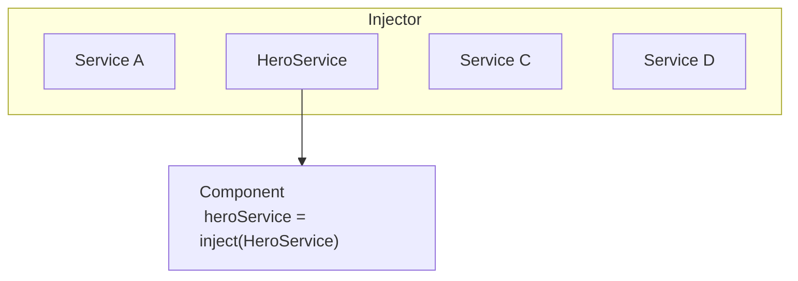

# Entendiendo la inyección de dependencias

La inyección de dependencias, o DI, es uno de los conceptos fundamentales en Angular. DI está integrado en el framework de Angular y permite que las clases con decoradores de Angular, como Componentes, Directivas, Pipes e Injectables, configuren las dependencias que necesitan.

Existen dos roles principales en el sistema DI: consumidor de dependencias y proveedor de dependencias.

Angular facilita la interacción entre consumidores de dependencias y proveedores de dependencias usando una abstracción llamada `Injector`. Cuando se solicita una dependencia, el inyector verifica su registro para ver si ya hay una instancia disponible allí. Si no, se crea una nueva instancia y se almacena en el registro. Angular crea un inyector de toda la aplicación (también conocido como inyector "raíz") durante el proceso de bootstrap de la aplicación. En la mayoría de los casos no necesitas crear inyectores manualmente, pero debes saber que hay una capa que conecta proveedores y consumidores.

Este tema cubre escenarios básicos de cómo una clase puede actuar como una dependencia. Angular también te permite usar funciones, objetos, tipos primitivos como string o Boolean, o cualquier otro tipo como dependencias. Para más información, consulta [Proveedores de dependencias](guide/di/dependency-injection-providers).

## Proporcionando una dependencia

Considera una clase llamada `HeroService` que necesita actuar como una dependencia en un componente.

El primer paso es agregar el decorador `@Injectable` para mostrar que la clase puede ser inyectada.

<docs-code language="typescript" highlight="[1]">
@Injectable()
class HeroService {}
</docs-code>

El siguiente paso es hacerla disponible en el sistema de ID, proveyéndola. 
Una dependencia se puede proveer en varios lugares:

- [**Preferido**: A nivel raíz de la aplicación usando `providedIn`](#preferido-a-nivel-raíz-de-la-aplicación-usando-providedin)
- [A nivel de Componente](#a-nivel-de-componente)
- [A nivel raíz de la aplicación usando `ApplicationConfig`](#a-nivel-raíz-de-la-aplicación-usando-applicationconfig)
- [Aplicaciones basadas en `NgModule`](#aplicaciones-basadas-en-ngmodule)

### **Preferido**: A nivel raíz de la aplicación usando `providedIn`

Proveer un servicio a nivel raíz de la aplicación usando `providedIn` permite inyectar el servicio en todas las demás clases.
Usar `providedIn` permite que Angular y los optimizadores de código JavaScript eliminen efectivamente los servicios que no se usan (conocido como tree-shaking).

Puedes proveer un servicio usando `providedIn: 'root'` en el decorador `@Injectable`:

<docs-code language="typescript" highlight="[2]">
@Injectable({
  providedIn: 'root'
})
class HeroService {}
</docs-code>

Cuando provees el servicio a nivel raíz, Angular crea una instancia única y compartida del `HeroService` y la inyecta en cualquier clase que la solicite.

### A nivel de Componente

Puedes proveer servicios a nivel `@Component` usando el campo `providers` del decorador `@Component`.
En este caso el `HeroService` se vuelve disponible para todas las instancias de este componente y otros componentes y directivas usadas en la plantilla.

Por ejemplo:

<docs-code language="typescript" highlight="[4]">
@Component({
  selector: 'hero-list',
  template: '...',
  providers: [HeroService]
})
class HeroListComponent {}
</docs-code>

Cuando registras un proveedor a nivel de componente, obtienes una nueva instancia del servicio con cada nueva instancia de ese componente.

NOTA: Declarar un servicio de esta manera hace que `HeroService` siempre se incluya en tu aplicación, incluso si el servicio no se usa.

### A nivel raíz de la aplicación usando `ApplicationConfig`

Puedes usar el campo `providers` de `ApplicationConfig` (pasado a la función `bootstrapApplication`) para proveer un servicio u otro `Injectable` a nivel de aplicación.

En el siguiente ejemplo, el `HeroService` está disponible para todos los componentes, directivas y pipes:

<docs-code language="typescript" highlight="[3]">
export const appConfig: ApplicationConfig = {
    providers: [
      { provide: HeroService },
    ]
};
</docs-code>

Luego, en `main.ts`:

<docs-code language="typescript">
bootstrapApplication(AppComponent, appConfig)
</docs-code>

NOTA: Declarar un servicio de esta manera hace que `HeroService` siempre se incluya en tu aplicación, incluso si el servicio no se usa.

### Aplicaciones basadas en `NgModule`

Las aplicaciones basadas en `@NgModule` usan el campo `providers` del decorador `@NgModule` para proveer un servicio u otro `Injectable` disponible a nivel de aplicación.

Un servicio proveído en un módulo está disponible para todas las declaraciones del módulo, o para cualquier otro módulo que comparta el mismo `ModuleInjector`.
Para entender todos los casos límite, consulta [Inyectores jerárquicos](guide/di/hierarchical-dependency-injection).

NOTA: Declarar un servicio usando `providers` hace que el servicio se incluya en tu aplicación, incluso si el servicio no se usa.

## Inyectando/consumiendo una dependencia

Usa la función `inject` de Angular para recuperar dependencias.

```ts
import {inject, Component} from 'angular/core';

@Component({/* ... */})
export class UserProfile {
  // Puedes usar la función `inject` en inicializadores de propiedades.
  private userClient = inject(UserClient);

  constructor() {
    // También puedes usar la función `inject` en un constructor.
    const logger = inject(Logger);
  }
}
```

Puedes usar la función `inject` en cualquier [contexto de inyección](guide/di/dependency-injection-context). La mayoría de las veces, esto es en un inicializador de propiedad de clase o un constructor de clase para componentes, directivas, servicios y pipes.

Cuando Angular descubre que un componente depende de un servicio, primero verifica si el inyector tiene alguna instancia existente de ese servicio. Si una instancia de servicio solicitada aún no existe, el inyector crea una usando el proveedor registrado, y la agrega al inyector antes de devolver el servicio a Angular.

Cuando todos los servicios solicitados han sido resueltos y devueltos, Angular puede llamar al constructor del componente con esos servicios como argumentos.



## Próximos pasos

<docs-pill-row>
  <docs-pill href="/guide/di/creating-injectable-service" title="Creando un servicio inyectable"/>
</docs-pill-row>
