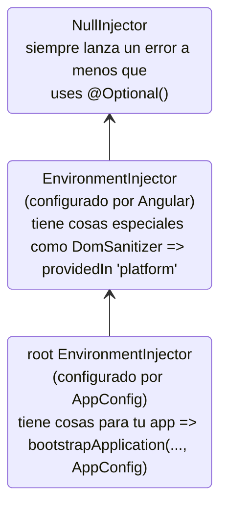
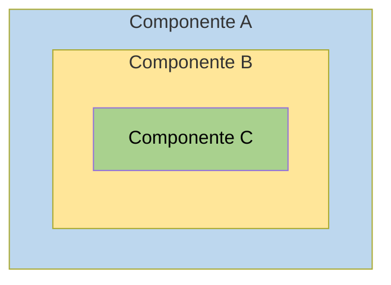
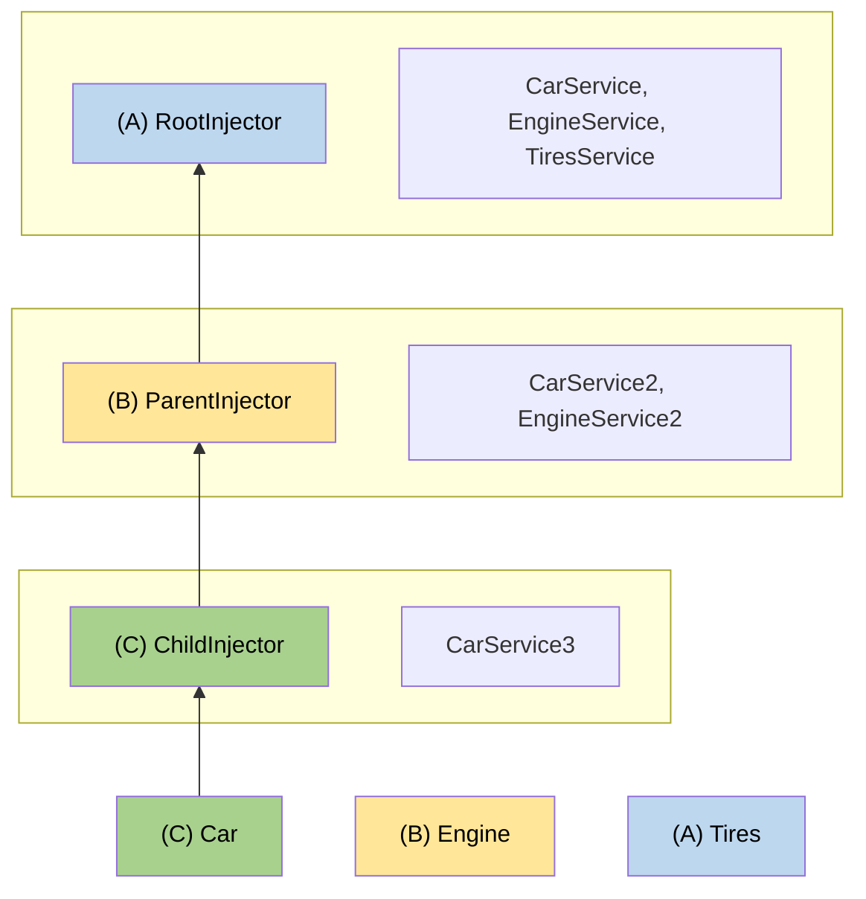

# Inyectores jerárquicos

Los inyectores en Angular tienen reglas que puedes aprovechar para lograr la visibilidad deseada de inyectables en tus aplicaciones.
Al entender estas reglas, puedes determinar si declarar un proveedor a nivel de aplicación, en un Componente, o en una Directiva.

Las aplicaciones que construyes con Angular pueden volverse bastante grandes, y una forma de manejar esta complejidad es dividir la aplicación en un árbol bien definido de componentes.

Puede haber secciones de tu página que funcionen de una manera completamente independiente al resto de la aplicación, con sus propias copias locales de los servicios y otras dependencias que necesita.
Algunos de los servicios que estas secciones de la aplicación usan podrían ser compartidos con otras partes de la aplicación, o con componentes padre que están más arriba en el árbol de componentes, mientras que otras dependencias están destinadas a ser privadas.

Con la inyección de dependencias jerárquica, puedes aislar secciones de la aplicación y darles sus propias dependencias privadas no compartidas con el resto de la aplicación, o hacer que los componentes padre compartan ciertas dependencias con sus componentes hijo únicamente pero no con el resto del árbol de componentes, y así sucesivamente. La inyección de dependencias jerárquica te permite compartir dependencias entre diferentes partes de la aplicación solo cuando y si las necesitas.

## Tipos de jerarquías de inyectores

Angular tiene dos jerarquías de inyectores:

| Jerarquías de inyectores        | Detalles |
|:---                         |:---     |
| Jerarquía `EnvironmentInjector` | Configura un `EnvironmentInjector` en esta jerarquía usando `@Injectable()` o array `providers` en `ApplicationConfig`. |
| Jerarquía `ElementInjector` | Creada implícitamente en cada elemento DOM. Un `ElementInjector` está vacío por defecto a menos que lo configures en la propiedad `providers` en `@Directive()` o `@Component()`. |

<docs-callout title="Aplicaciones basadas en NgModule">
Para aplicaciones basadas en `NgModule`, puedes proveer dependencias con la jerarquía `ModuleInjector` usando una anotación `@NgModule()` o `@Injectable()`.
</docs-callout>

### `EnvironmentInjector`

El `EnvironmentInjector` puede ser configurado de una de dos maneras usando:

* La propiedad `providedIn` de `@Injectable()` para referirse a `root` o `platform`
* El array `providers` de `ApplicationConfig`

<docs-callout title="Tree-shaking y @Injectable()">

Usar la propiedad `providedIn` de `@Injectable()` es preferible a usar el array `providers` de `ApplicationConfig`. Con `providedIn` de `@Injectable()`, las herramientas de optimización pueden realizar tree-shaking, que elimina servicios que tu aplicación no está usando. Esto resulta en tamaños de paquete más pequeños.

El tree-shaking es especialmente útil para una biblioteca porque la aplicación que usa la biblioteca puede no tener necesidad de inyectarla.

</docs-callout>

`EnvironmentInjector` está configurado por `ApplicationConfig.providers`.

Provee servicios usando `providedIn` de `@Injectable()` de la siguiente manera:

<docs-code language="typescript" highlight="[4]">
import { Injectable } from '@angular/core';

@Injectable({
  providedIn: 'root'  // <--provee este servicio en el EnvironmentInjector raíz
})
export class ItemService {
  name = 'telephone';
}

</docs-code>

El decorador `@Injectable()` identifica una clase de servicio.
La propiedad `providedIn` configura un `EnvironmentInjector` específico, en este caso `root`, que hace que el servicio esté disponible en el `EnvironmentInjector` `root`.

### ModuleInjector

En el caso de aplicaciones basadas en `NgModule`, el ModuleInjector puede ser configurado de una de dos maneras usando:

* La propiedad `providedIn` de `@Injectable()` para referirse a `root` o `platform`
* El array `providers` de `@NgModule()`

`ModuleInjector` está configurado por la propiedad `@NgModule.providers` y `NgModule.imports`. `ModuleInjector` es un aplanamiento de todos los arrays de proveedores que pueden ser alcanzados siguiendo `NgModule.imports` recursivamente.

Las jerarquías hijas de `ModuleInjector` se crean cuando se cargan perezosamente otros `@NgModules`.

### Inyector de plataforma

Hay dos inyectores más arriba de `root`, un `EnvironmentInjector` adicional y `NullInjector()`.

Considera cómo Angular inicializa la aplicación con lo siguiente en `main.ts`:

<docs-code language="javascript">
bootstrapApplication(AppComponent, appConfig);
</docs-code>

El método `bootstrapApplication()` crea un inyector hijo del inyector de plataforma que se configura mediante la la instancia `ApplicationConfig`.
Este es el `EnvironmentInjector` `root`.

El método `platformBrowserDynamic()` crea un inyector configurado por un `PlatformModule`, que contiene dependencias específicas de la plataforma.
Esto permite que múltiples aplicaciones compartan una configuración de plataforma.
Por ejemplo, un navegador tiene solo una barra de URL, sin importar cuántas aplicaciones tengas ejecutándose.
Puedes configurar proveedores adicionales específicos de la plataforma a nivel de plataforma suministrando `extraProviders` usando la función `platformBrowser()`.

El siguiente inyector padre en la jerarquía es el `NullInjector()`, que está en la parte superior del árbol.
Si has ido tan arriba en el árbol que estás buscando un servicio en el `NullInjector()`, obtendrás un error a menos que hayas usado `@Optional()` porque en última instancia, todo termina en el `NullInjector()` y devuelve un error o, en el caso de `@Optional()`, `null`.
Para más información sobre `@Optional()`, consulta la [sección `@Optional()`](#optional) de esta guía.

El siguiente diagrama representa la relación entre el `ModuleInjector` `root` y sus inyectores padre como describen los párrafos anteriores.



Mientras que el nombre `root` es un alias especial, otras jerarquías de `EnvironmentInjector` no tienen alias.
Tienes la opción de crear jerarquías de `EnvironmentInjector` cada vez que se crea un componente cargado dinámicamente, como con el Router, que creará jerarquías hijas de `EnvironmentInjector`.

Todas las solicitudes se reenvían al inyector raíz, ya sea que lo hayas configurado con la instancia `ApplicationConfig` pasada al método `bootstrapApplication()`, o registrado todos los proveedores con `root` en sus propios servicios.

<docs-callout title="@Injectable() vs. ApplicationConfig">

Si configuras un proveedor de toda la aplicación en el `ApplicationConfig` de `bootstrapApplication`, sobrescribe uno configurado para `root` en los metadatos `@Injectable()`.
Puedes hacer esto para configurar un proveedor no por defecto de un servicio que se comparte con múltiples aplicaciones.

Aquí tienes un ejemplo del caso donde la configuración del router de componentes incluye una [estrategia de ubicación](guide/routing#location-strategy) no por defecto listando su proveedor en la lista `providers` del `ApplicationConfig`.

```ts
providers: [
  { provide: LocationStrategy, useClass: HashLocationStrategy }
]
```

Para aplicaciones basadas en `NgModule`, configura proveedores de toda la aplicación en los `providers` de `AppModule`.

</docs-callout>

### `ElementInjector`

Angular crea jerarquías de `ElementInjector` implícitamente para cada elemento DOM.

Proveer un servicio en el decorador `@Component()` usando su propiedad `providers` o `viewProviders` configura un `ElementInjector`.
Por ejemplo, el siguiente `TestComponent` configura el `ElementInjector` proveyendo el servicio de la siguiente manera:

<docs-code language="typescript" highlight="[3]">
@Component({
  …
  providers: [{ provide: ItemService, useValue: { name: 'lamp' } }]
})
export class TestComponent
</docs-code>

ÚTIL: Consulta la sección [reglas de resolución](#resolution-rules) para entender la relación entre el árbol `EnvironmentInjector`, el `ModuleInjector` y el árbol `ElementInjector`.

Cuando provees servicios en un componente, ese servicio está disponible por medio del `ElementInjector` en esa instancia de componente.
También puede ser visible en componentes/directivas hijo basándose en las reglas de visibilidad descritas en la sección [reglas de resolución](#resolution-rules).

Cuando la instancia del componente se destruye, también se destruye esa instancia del servicio.

#### `@Directive()` y `@Component()`

Un componente es un tipo especial de directiva, lo que significa que así como `@Directive()` tiene una propiedad `providers`, `@Component()` también la tiene.
Esto significa que las directivas así como los componentes pueden configurar proveedores, usando la propiedad `providers`.
Cuando configuras un proveedor para un componente o directiva usando la propiedad `providers`, ese proveedor pertenece al `ElementInjector` de ese componente o directiva.
Los componentes y directivas en el mismo elemento comparten un inyector.

## Reglas de resolución

Al resolver un token para un componente/directiva, Angular lo resuelve en dos fases:

1. Contra sus padres en la jerarquía `ElementInjector`.
2. Contra sus padres en la jerarquía `EnvironmentInjector`.

Cuando un componente declara una dependencia, Angular trata de satisfacer esa dependencia con su propio `ElementInjector`.
Si el inyector del componente carece del proveedor, pasa la solicitud al `ElementInjector` del componente padre.

Las solicitudes siguen reenviándose hacia arriba hasta que Angular encuentra un inyector que puede manejar la solicitud o se queda sin jerarquías de `ElementInjector` ancestros.

Si Angular no encuentra el proveedor en ninguna jerarquía `ElementInjector`, regresa al elemento donde se originó la solicitud y busca en la jerarquía `EnvironmentInjector`.
Si Angular aún no encuentra el proveedor, lanza un error.

Si has registrado un proveedor para el mismo token DI en diferentes niveles, el primero que Angular encuentra es el que usa para resolver la dependencia.
Si, por ejemplo, un proveedor está registrado localmente en el componente que necesita un servicio,
Angular no busca otro proveedor del mismo servicio.

ÚTIL: Para aplicaciones basadas en `NgModule`, Angular buscará en la jerarquía `ModuleInjector` si no puede encontrar un proveedor en las jerarquías `ElementInjector`.

## Modificadores de resolución

El comportamiento de resolución de Angular puede ser modificado con `optional`, `self`, `skipSelf` y `host`.
Importa cada uno de ellos desde `@angular/core` y usa cada uno en la configuración `inject` cuando inyectes tu servicio.

### Tipos de modificadores

Los modificadores de resolución caen en tres categorías:

* Qué hacer si Angular no encuentra lo que estás buscando, eso es `optional`
* Dónde empezar a buscar, eso es `skipSelf`
* Dónde parar de buscar, `host` y `self`

Por defecto, Angular siempre comienza en el `Injector` actual y sigue buscando todo el camino hacia arriba.
Los modificadores te permiten cambiar la ubicación de inicio, o _self_, y la ubicación de finalización.

Además, puedes combinar todos los modificadores excepto:

* `host` y `self`
* `skipSelf` y `self`.

### `optional`

`optional` permite que Angular considere un servicio que inyectas como opcional.
De esta manera, si no puede ser resuelto en tiempo de ejecución, Angular resuelve el servicio como `null`, en lugar de lanzar un error.
En el siguiente ejemplo, el servicio, `OptionalService`, no está proveído en el servicio, `ApplicationConfig`, `@NgModule()`, o clase de componente, por lo que no está disponible en ningún lugar de la aplicación.

<docs-code header="src/app/optional/optional.component.ts" language="typescript">
export class OptionalComponent {
  public optional? = inject(OptionalService, {optional: true});
}
</docs-code>

### `self`

Usa `self` para que Angular solo mire el `ElementInjector` para el componente o directiva actual.

Un buen caso de uso para `self` es inyectar un servicio pero solo si está disponible en el elemento host actual.
Para evitar errores en esta situación, combina `self` con `optional`.

Por ejemplo, en el siguiente `SelfNoDataComponent`, nota el `LeafService` inyectado como una propiedad.

<docs-code header="src/app/self-no-data/self-no-data.component.ts" language="typescript"
           highlight="[7]">
@Component({
  selector: 'app-self-no-data',
  templateUrl: './self-no-data.component.html',
  styleUrls: ['./self-no-data.component.css']
})
export class SelfNoDataComponent {
  public leaf = inject(LeafService, {optional: true, self: true});
}
</docs-code>

In this example, there is a parent provider and injecting the service will return the value, however, injecting the service with `self` and `optional` will return `null` because `self` tells the injector to stop searching in the current host element.

Otro ejemplo muestra la clase de componente con un proveedor para `FlowerService`.
En este caso, el inyector no busca más allá del `ElementInjector` actual porque encuentra el `FlowerService` y devuelve el tulipán <code>&#x1F337;</code>.

<docs-code header="src/app/self/self.component.ts" path="adev/src/content/examples/resolution-modifiers/src/app/self/self.component.ts" visibleRegion="self-component"/>

### `skipSelf`

`skipSelf` es lo opuesto a `self`.
Con `skipSelf`, Angular comienza su búsqueda de un servicio en el `ElementInjector` padre, en lugar del actual.
Así que si el `ElementInjector` padre estuviera usando el valor de helecho <code>&#x1F33F;</code> para `emoji`, pero tuvieras hoja de arce <code>&#x1F341;</code> en el array `providers` del componente, Angular ignoraría la hoja de arce <code>&#x1F341;</code> y usaría el helecho <code>&#x1F33F;</code>.

Para ver esto en código, asume que el siguiente valor para `emoji` es lo que el componente padre estaría usando, como en este servicio:

<docs-code header="src/app/leaf.service.ts" language="typescript">
export class LeafService {
  emoji = '🌿';
}
</docs-code>

Imagina que en el componente hijo, tenías un valor diferente, hoja de arce <code>&#x1F341;</code> pero querías usar el valor del padre en su lugar.
Esto es cuando usarías `skipSelf`:

<docs-code header="src/app/skipself/skipself.component.ts" language="typescript"
           highlight="[[6],[10]]">
@Component({
  selector: 'app-skipself',
  templateUrl: './skipself.component.html',
  styleUrls: ['./skipself.component.css'],
  // Angular ignoraría esta instancia de LeafService
  providers: [{ provide: LeafService, useValue: { emoji: '🍁' } }]
})
export class SkipselfComponent {
  // Usa skipSelf como opción de inyección
  public leaf = inject(LeafService, {skipSelf: true});
}
</docs-code>

En este caso, el valor que obtendrías para `emoji` sería helecho <code>&#x1F33F;</code>, no hoja de arce <code>&#x1F341;</code>.

#### Opción `skipSelf` con `optional`

Usa la opción `skipSelf` con `optional` para prevenir un error si el valor es `null`.

En el siguiente ejemplo, el servicio `Person` se inyecta durante la inicialización de la propiedad.
`skipSelf` le dice a Angular que omita el inyector actual y `optional` prevendrá un error si el servicio `Person` es `null`.

<docs-code language="typescript">
class Person {
  parent = inject(Person, {optional: true, skipSelf: true})
}
</docs-code>

### `host`

<!-- TODO: Remove ambiguity between host and self. -->

`host` te permite designar un componente como la última parada en el árbol de inyectores cuando buscas proveedores.

Incluso si hay una instancia de servicio más arriba en el árbol, Angular no continuará buscando.
Usa `host` de la siguiente manera:

<docs-code header="src/app/host/host.component.ts" language="typescript"
           highlight="[[6],[10]]">
@Component({
  selector: 'app-host',
  templateUrl: './host.component.html',
  styleUrls: ['./host.component.css'],
  //  provee el servicio
  providers: [{ provide: FlowerService, useValue: { emoji: '🌷' } }]
})
export class HostComponent {
  // usa host cuando inyectes el servicio
  flower = inject(FlowerService, {host: true, optional: true});
}
</docs-code>

Dado que `HostComponent` tiene la opción `host`, sin importar lo que el padre de `HostComponent` pueda tener como valor `flower.emoji`, el `HostComponent` usará tulipán <code>&#x1F337;</code>.

### Modificadores con inyección de constructor  

De manera similar a como se presentó antes, el comportamiento de la inyección de constructor puede ser modificado con `@Optional()`, `@Self()`, `@SkipSelf()` y `@Host()`.

Importa cada uno de ellos desde `@angular/core` y usa cada uno en el constructor de la clase de componente cuando inyectes tu servicio.

<docs-code header="src/app/self-no-data/self-no-data.component.ts" language="typescript" highlight="[3]">
export class SelfNoDataComponent {
  constructor(@Self() @Optional() public leaf?: LeafService) { }
}
</docs-code>

## Estructura lógica de la plantilla

Cuando provees servicios en la clase de componente, los servicios son visibles dentro del árbol `ElementInjector` relativo a dónde y cómo provees esos servicios.

Entender la estructura lógica subyacente de la plantilla de Angular te dará una base para configurar servicios y a su vez controlar su visibilidad.

Los componentes se usan en tus plantillas, como en el siguiente ejemplo:

<docs-code language="html">
<app-root>
  <app-child></app-child>;
</app-root>
</docs-code>

ÚTIL: Usualmente, declaras los componentes y sus plantillas en archivos separados.
Para los propósitos de entender cómo funciona el sistema de inyección, es útil mirarlos desde el punto de vista de un árbol lógico combinado.
El término _lógico_ lo distingue del árbol de renderizado, que es el árbol DOM de tu aplicación.
Para marcar las ubicaciones de dónde están ubicadas las plantillas de componentes, esta guía usa el pseudo-elemento `<#VIEW>`, que en realidad no existe en el árbol de renderizado y está presente solo para propósitos de modelo mental.

El siguiente es un ejemplo de cómo los árboles de vista `<app-root>` y `<app-child>` se combinan en un solo árbol lógico:

<docs-code language="html">
<app-root>
  <#VIEW>
    <app-child>
     <#VIEW>
       …el contenido va aquí…
     </#VIEW>
    </app-child>
  </#VIEW>
</app-root>
</docs-code>

Entender la idea de la demarcación `<#VIEW>` es especialmente significativo cuando configuras servicios en la clase de componente.

## Ejemplo: Proveyendo servicios en `@Component()`

Cómo provees servicios usando un decorador `@Component()` (o `@Directive()`) determina su visibilidad.
Las siguientes secciones demuestran `providers` y `viewProviders` junto con formas de modificar la visibilidad del servicio con `skipSelf` y `host`.

Una clase de componente puede proveer servicios de dos maneras:

| Arrays                       | Detalles |
|:---                          |:---     |
| Con un array `providers`     | `@Component({ providers: [SomeService] })`     |
| Con un array `viewProviders` | `@Component({ viewProviders: [SomeService] })` |

En los ejemplos de abajo, verás el árbol lógico de una aplicación Angular.
Para ilustrar cómo funciona el inyector en el contexto de plantillas, el árbol lógico representará la estructura HTML de la aplicación.
Por ejemplo, el árbol lógico mostrará que `<child-component>` es un hijo directo de `<parent-component>`.

En el árbol lógico, verás atributos especiales: `@Provide`, `@Inject`, y `@ApplicationConfig`.
Estos no son atributos reales pero están aquí para demostrar lo que está pasando internamente.

| Atributo de servicio Angular                                                                                           | Detalles |
|:---                                                                                                                |:---     |
| `@Inject(Token)=>Value`     | Si `Token` se inyecta en esta ubicación en el árbol lógico, su valor sería `Value`.     |
| `@Provide(Token=Value)`     | Indica que `Token` se provee con `Value` en esta ubicación en el árbol lógico.        |
| `@ApplicationConfig` | Demuestra que se debe usar un `EnvironmentInjector` de respaldo en esta ubicación.          |

### Estructura de aplicación de ejemplo

La aplicación de ejemplo tiene un `FlowerService` proveído en `root` con un valor `emoji` de hibisco rojo <code>&#x1F33A;</code>.

<docs-code header="src/app/flower.service.ts" language="typescript">
@Injectable({
  providedIn: 'root'
})
export class FlowerService {
  emoji = '🌺';
}
</docs-code>

Considera una aplicación con solo un `AppComponent` y un `ChildComponent`.
La vista renderizada más básica se vería como elementos HTML anidados como los siguientes:

<docs-code language="html">

<app-root> <!-- selector de AppComponent -->
  <app-child> <!-- selector de ChildComponent -->
  </app-child>
</app-root>

</docs-code>

Sin embargo, detrás de escena, Angular utiliza una representación de vista lógica de la siguiente manera al resolver las solicitudes de inyección:

<docs-code language="html">
<app-root> <!-- selector de AppComponent -->
  <#VIEW>
    <app-child> <!-- selector de ChildComponent -->
      <#VIEW>
      </#VIEW>
    </app-child>
  </#VIEW>
</app-root>
</docs-code>

El `<#VIEW>` aquí representa una instancia de una plantilla.
Nota que cada componente tiene su propio `<#VIEW>`.

El conocimiento de esta estructura puede informar cómo provees e inyectas tus servicios, y darte control completo de la visibilidad del servicio.

Ahora, considera que `<app-root>` inyecta el `FlowerService`:

<docs-code header="src/app/app.component.ts" language="typescript">
export class AppComponent  {
  flower = inject(FlowerService);
}
</docs-code>

Agrega un enlace a la plantilla `<app-root>` para visualizar el resultado:

<docs-code header="src/app/app.component.html" language="html">
<p>Emoji de FlowerService: {{flower.emoji}}</p>
</docs-code>

La salida en la vista sería:

<docs-code language="shell">
Emoji from FlowerService: &#x1F33A;
</docs-code>

En el árbol lógico, esto se representaría como sigue:

<docs-code language="html" highlight="[[1],[2],[4]]">
<app-root @ApplicationConfig
        @Inject(FlowerService) flower=>"&#x1F33A;">
  <#VIEW>
    <p>Emoji de FlowerService: {{flower.emoji}} (&#x1F33A;)</p>
    <app-child>
      <#VIEW>
      </#VIEW>
    </app-child>
  </#VIEW>
</app-root>

</docs-code>

Cuando `<app-root>` solicita el `FlowerService`, es trabajo del inyector resolver el token `FlowerService`.
La resolución del token sucede en dos fases:

1. El inyector determina la ubicación de inicio en el árbol lógico y una ubicación de finalización de la búsqueda.
    El inyector comienza con la ubicación de inicio y busca el token en cada nivel de vista en el árbol lógico.
    Si el token se encuentra, se devuelve.

1. Si el token no se encuentra, el inyector busca el `EnvironmentInjector` padre más cercano para delegar la solicitud.

En el caso del ejemplo, las restricciones son:

1. Comienza con `<#VIEW>` perteneciente a `<app-root>` y termina con `<app-root>`.

    * Normalmente el punto de partida para la búsqueda es en el punto de inyección.
        Sin embargo, en este caso `<app-root>` es un componente. Los `@Component`s son especiales en que también incluyen sus propios `viewProviders`, por lo que la búsqueda comienza en `<#VIEW>` perteneciente a `<app-root>`.
        Este no sería el caso para una directiva coincidente en la misma ubicación.
    * La ubicación de finalización resulta ser la misma que el componente mismo, porque es el componente superior en esta aplicación.

1. El `EnvironmentInjector` proveído por el `ApplicationConfig` actúa como el inyector de respaldo cuando el token de inyección no puede ser encontrado en las jerarquías `ElementInjector`.

### Usando el array `providers`

Ahora, en la clase `ChildComponent`, agrega un proveedor para `FlowerService` para demostrar reglas de resolución más complejas en las próximas secciones:

<docs-code header="src/app/child.component.ts" language="typescript"
           highlight="[[5,6],[10]]">
@Component({
  selector: 'app-child',
  templateUrl: './child.component.html',
  styleUrls: ['./child.component.css'],
  // usa el array providers para proveer un servicio
  providers: [{ provide: FlowerService, useValue: { emoji: '🌻' } }]
})
export class ChildComponent {
  // inyecta el servicio
  flower = inject(FlowerService);
}
</docs-code>

Ahora que el `FlowerService` está proveído en el decorador `@Component()`, cuando `<app-child>` solicita el servicio, el inyector solo tiene que mirar tan lejos como el `ElementInjector` en `<app-child>`.
No tendrá que continuar la búsqueda más allá a través del árbol de inyectores.

El siguiente paso es agregar un enlace a la plantilla `ChildComponent`.

<docs-code header="src/app/child.component.html" language="html">
<p>Emoji de FlowerService: {{flower.emoji}}</p>
</docs-code>

Para renderizar los nuevos valores, agrega `<app-child>` al final de la plantilla `AppComponent` para que la vista también muestre el girasol:

<docs-code language="shell">
Child Component
Emoji de FlowerService: &#x1F33B;
</docs-code>

En el árbol lógico, esto se representa de la siguiente manera:

<docs-code language="html">

<app-root @ApplicationConfig
        @Inject(FlowerService) flower=>"&#x1F33A;">
  <#VIEW>
    <p>Emoji de FlowerService: {{flower.emoji}} (&#x1F33A;)</p>
    <app-child @Provide(FlowerService="&#x1F33B;")
               @Inject(FlowerService)=>"&#x1F33B;"> <!-- la búsqueda termina aquí -->
      <#VIEW> <!-- la búsqueda comienza aquí -->
        <h2>Child Component</h2>
        <p>Emoji de FlowerService: {{flower.emoji}} (&#x1F33B;)</p>
      </#VIEW>
    </app-child>
  </#VIEW>
</app-root>

</docs-code>

Cuando `<app-child>` solicita el `FlowerService`, el inyector comienza su búsqueda en el `<#VIEW>` perteneciente a `<app-child>` \(`<#VIEW>` está incluido porque se inyecta desde `@Component()`\) y termina con `<app-child>`.
En este caso, el `FlowerService` se resuelve en el array `providers` con girasol <code>&#x1F33B;</code> del `<app-child>`.
El inyector no tiene que buscar más en el árbol de inyectores.
Se detiene tan pronto como encuentra el `FlowerService` y nunca ve el hibisco rojo <code>&#x1F33A;</code>.

### Usando el array `viewProviders`

Usa el array `viewProviders` como otra forma de proveer servicios en el decorador `@Component()`.
Usar `viewProviders` hace que los servicios sean visibles en el `<#VIEW>`.

ÚTIL: Los pasos son los mismos que usar el array `providers`, con la excepción de usar el array `viewProviders` en su lugar.

Para instrucciones paso a paso, continúa con esta sección.
Si puedes configurarlo por tu cuenta, salta adelante a [Modificando la disponibilidad del servicio](#visibility-of-provided-tokens).

Para demostración, estamos construyendo un `AnimalService` para demostrar `viewProviders`.
Primero, crea un `AnimalService` con una propiedad `emoji` de ballena <code>&#x1F433;</code>:

<docs-code header="src/app/animal.service.ts" language="typescript">
import { Injectable } from '@angular/core';

@Injectable({
  providedIn: 'root'
})
export class AnimalService {
  emoji = '🐳';
}
</docs-code>

Siguiendo el mismo patrón que con el `FlowerService`, inyecta el `AnimalService` en la clase `AppComponent`:

<docs-code header="src/app/app.component.ts" language="typescript" highlight="[4]">
export class AppComponent {
    public flower = inject(FlowerService);
    public animal = inject(AnimalService);
}
</docs-code>

ÚTIL: Puedes dejar todo el código relacionado con `FlowerService` en su lugar, ya que permitirá una comparación con el `AnimalService`.

Agrega un array `viewProviders` e inyecta el `AnimalService` en la clase `<app-child>` también, pero dale a `emoji` un valor diferente.
Aquí, tiene un valor de perro <code>&#x1F436;</code>.

<docs-code header="src/app/child.component.ts" language="typescript"
           highlight="[[7],[11]]">
@Component({
  selector: 'app-child',
  templateUrl: './child.component.html',
  styleUrls: ['./child.component.css'],
  // provee servicios
  providers: [{ provide: FlowerService, useValue: { emoji: '��' } }],
  viewProviders: [{ provide: AnimalService, useValue: { emoji: '🐶' } }]
})
export class ChildComponent {
  // inyecta servicios
  flower = inject(FlowerService); 
  animal = inject(AnimalService)
...
}
</docs-code>

Agrega enlaces a la plantilla `ChildComponent` y la plantilla `AppComponent`.
En la plantilla `ChildComponent`, agrega el siguiente enlace:

<docs-code header="src/app/child.component.html" language="html">
<p>Emoji de AnimalService: {{animal.emoji}}</p>
</docs-code>

Además, agrega lo mismo a la plantilla `AppComponent`:

<docs-code header="src/app/app.component.html" language="html">
<p>Emoji de AnimalService: {{animal.emoji}}</p>s
</docs-code>

Ahora deberías ver ambos valores en el navegador:

<docs-code hideCopy language="shell">

AppComponent
Emoji de AnimalService: &#x1F433;

Child Component
Emoji de AnimalService: &#x1F436;

</docs-code>

El árbol lógico para este ejemplo de `viewProviders` es como sigue:

<docs-code language="html">

<app-root @ApplicationConfig
         @Inject(AnimalService) animal=>"&#x1F433;">
  <#VIEW>
    <app-child>
      <#VIEW @Provide(AnimalService="&#x1F436;")
            @Inject(AnimalService=>"&#x1F436;")>
       <!-- ^^usar viewProviders significa que AnimalService está disponible en <#VIEW>-->
       <p>Emoji de AnimalService: {{animal.emoji}} (&#x1F436;)</p>
      </#VIEW>
    </app-child>
  </#VIEW>
</app-root>

</docs-code>

Así como con el ejemplo de `FlowerService`, el `AnimalService` está proveído en el decorador `@Component()` de `<app-child>`.
Esto significa que como el inyector primero busca en el `ElementInjector` del componente, encuentra el valor `AnimalService` de perro <code>&#x1F436;</code>.
No necesita continuar buscando en el árbol `ElementInjector`, ni necesita buscar en el `ModuleInjector`.

### `providers` vs. `viewProviders`

El campo `viewProviders` es conceptualmente similar a `providers`, pero hay una diferencia notable.
Los proveedores configurados en `viewProviders` no son visibles al contenido proyectado que termina como hijos lógicos del componente.

Para ver la diferencia entre usar `providers` y `viewProviders`, agrega otro componente al ejemplo y llámalo `InspectorComponent`.
`InspectorComponent` será un hijo del `ChildComponent`.
En `inspector.component.ts`, inyecta el `FlowerService` y `AnimalService` durante la inicialización de la propiedad:

<docs-code header="src/app/inspector/inspector.component.ts" language="typescript">
export class InspectorComponent {
  flower = inject(FlowerService);
  animal = inject(AnimalService);
}
</docs-code>

No necesitas un array `providers` o `viewProviders`.
A continuación, en `inspector.component.html`, agrega la misma plantilla de componentes anteriores:

<docs-code header="src/app/inspector/inspector.component.html" language="html">
<p>Emoji de FlowerService: {{flower.emoji}}</p>
<p>Emoji de AnimalService: {{animal.emoji}}</p>
</docs-code>

Recuerda agregar el `InspectorComponent` al array `imports` de `ChildComponent`.

<docs-code header="src/app/child/child.component.ts" language="typescript"
           highlight="[3]">
@Component({
  ...
  imports: [InspectorComponent]
})

</docs-code>

A continuación, agrega lo siguiente a `child.component.html`:

<docs-code header="src/app/child/child.component.html" language="html"
           highlight="[3,9]">
...

<div class="container">
  <h3>Proyección de contenido</h3>
  <ng-content></ng-content>
</div>
<h3>Dentro de la vista</h3>

<app-inspector></app-inspector>
</docs-code>

`<ng-content>` te permite proyectar contenido, y `<app-inspector>` dentro de la plantilla `ChildComponent` hace que el `InspectorComponent` sea un componente hijo de `ChildComponent`.

A continuación, agrega lo siguiente a `app.component.html` para aprovechar la proyección de contenido.

<docs-code header="src/app/app.component.html" language="html" highlight="[2]">
<app-child>
  <app-inspector></app-inspector>
</app-child>
</docs-code>

El navegador ahora renderiza lo siguiente, omitiendo los ejemplos anteriores por brevedad:

<docs-code hideCopy language="shell">
...
Proyección de contenido

Emoji de FlowerService: &#x1F33B;
Emoji de AnimalService: &#x1F433;

Emoji de FlowerService: &#x1F33B;
Emoji de AnimalService: &#x1F436;

</docs-code>

Estos cuatro enlaces demuestran la diferencia entre `providers` y `viewProviders`.
Recuerda que el emoji de perro <code>&#x1F436;</code> está declarado dentro del `<#VIEW>` de `ChildComponent` y no es visible al contenido proyectado.
En su lugar, el contenido proyectado ve la ballena <code>&#x1F433;</code>.

Sin embargo, en la siguiente sección de salida, aunque el `InspectorComponent` es un componente hijo real de `ChildComponent`, `InspectorComponent` está dentro del `<#VIEW>`, así que cuando pide el `AnimalService`, ve el perro <code>&#x1F436;</code>.

El `AnimalService` en el árbol lógico se vería así:

<docs-code language="html">

<app-root @ApplicationConfig
         @Inject(AnimalService) animal=>"&#x1F433;">
  <#VIEW>
    <app-child>
      <#VIEW @Provide(AnimalService="&#x1F436;")
            @Inject(AnimalService=>"&#x1F436;")>
        <!-- ^^usar viewProviders significa que AnimalService está disponible en <#VIEW>-->
        <p>Emoji de AnimalService: {{animal.emoji}} (&#x1F436;)</p>

        <div class="container">
          <h3>Proyección de contenido</h3>
          <app-inspector @Inject(AnimalService) animal=>"&#x1F433;">
            <p>Emoji de AnimalService: {{animal.emoji}} (&#x1F433;)</p>
          </app-inspector>
        </div>

        <app-inspector>
          <#VIEW @Inject(AnimalService) animal=>"&#x1F436;">
            <p>Emoji de AnimalService: {{animal.emoji}} (&#x1F436;)</p>
          </#VIEW>
        </app-inspector>
      </#VIEW>
    </app-child>
  </#VIEW>
</app-root>

</docs-code>

El contenido proyectado de `<app-inspector>` ve la ballena <code>&#x1F433;</code>, no el perro <code>&#x1F436;</code>, porque el perro <code>&#x1F436;</code> está dentro del `<#VIEW>` de `<app-child>`.
El `<app-inspector>` solo puede ver el perro <code>&#x1F436;</code> si también está dentro del `<#VIEW>`.

### Visibilidad de tokens proveídos

Los decoradores de visibilidad influyen en dónde comienza y termina la búsqueda del token de inyección en el árbol lógico.
Para hacer esto, coloca la configuración de visibilidad en el punto de inyección, es decir, cuando invocas `inject()`, en lugar de en un punto de declaración.

Para alterar dónde el inyector comienza a buscar `FlowerService`, agrega `skipSelf` a la invocación `inject()` de `<app-child>` donde se inyecta `FlowerService`.
Esta invocación es un inicializador de propiedad del `<app-child>` como se muestra en `child.component.ts`:

<docs-code language="typescript">
flower = inject(FlowerService, { skipSelf: true })
</docs-code>

Con `skipSelf`, el inyector de `<app-child>` no busca en sí mismo el `FlowerService`.
En su lugar, el inyector comienza a buscar el `FlowerService` en el `ElementInjector` del `<app-root>`, donde no encuentra nada.
Luego, regresa al `ModuleInjector` de `<app-child>` y encuentra el valor de hibisco rojo <code>&#x1F33A;</code>, que está disponible porque `<app-child>` y `<app-root>` comparten el mismo `ModuleInjector`.
La UI renderiza lo siguiente:

<docs-code hideCopy language="shell">

Emoji de FlowerService: &#x1F33A;

</docs-code>

En un árbol lógico, esta misma idea podría verse así:

<docs-code language="html">

<app-root @ApplicationConfig
        @Inject(FlowerService) flower=>"&#x1F33A;">
  <#VIEW>
    <app-child @Provide(FlowerService="&#x1F33B;")>
      <#VIEW @Inject(FlowerService, SkipSelf)=>"&#x1F33A;">
        <!-- Con SkipSelf, el inyector busca en el siguiente inyector arriba en el árbol (app-root) -->
      </#VIEW>
    </app-child>
  </#VIEW>
</app-root>

</docs-code>

Aunque `<app-child>` provee el girasol <code>&#x1F33B;</code>, la aplicación renderiza el hibisco rojo <code>&#x1F33A;</code> porque `skipSelf` hace que el inyector actual (`app-child`) se omita a sí mismo y busque en su padre.

Si ahora agregas `host` (además del `skipSelf`), el resultado será `null`.
Esto es porque `host` limita el límite superior de la búsqueda al `<#VIEW>` de `app-child`.
Aquí está la idea en el árbol lógico:

<docs-code language="html">

<app-root @ApplicationConfig
        @Inject(FlowerService) flower=>"&#x1F33A;">
  <#VIEW> <!-- la búsqueda termina aquí con null-->
    <app-child @Provide(FlowerService="&#x1F33B;")> <!-- comienza búsqueda aquí -->
      <#VIEW inject(FlowerService, {skipSelf: true, host: true, optional:true})=>null>
      </#VIEW>
      </app-parent>
  </#VIEW>
</app-root>

</docs-code>

Aquí, los servicios y sus valores son los mismos, pero `host` detiene al inyector de buscar más allá del `<#VIEW>` para `FlowerService`, así que no lo encuentra y devuelve `null`.

### `skipSelf` y `viewProviders`

Recuerda, `<app-child>` provee el `AnimalService` en el array `viewProviders` con el valor de perro <code>&#x1F436;</code>.
Como el inyector solo tiene que mirar el `ElementInjector` de `<app-child>` para el `AnimalService`, nunca ve la ballena <code>&#x1F433;</code>.

Como en el ejemplo de `FlowerService`, si agregas `skipSelf` al `inject()` de `AnimalService`, el inyector no buscará en el `ElementInjector` del `<app-child>` actual para el `AnimalService`.
En su lugar, el inyector comenzará en el `ElementInjector` de `<app-root>`.

<docs-code language="typescript" highlight="[5]">
@Component({
  selector: 'app-child',
  …
  viewProviders: [
    { provide: AnimalService, useValue: { emoji: '&#x1F436;' } },
  ],
})
</docs-code>

El árbol lógico con `skipSelf` en `<app-child>` se ve así:

<docs-code language="html">

<app-root @ApplicationConfig
          @Inject(AnimalService=>"&#x1F433;")>
  <#VIEW><!-- la busqueda inicia aquí-->
    <app-child>
      <#VIEW @Provide(AnimalService="&#x1F436;")
             @Inject(AnimalService, SkipSelf=>"&#x1F433;")>
        <!--Agregar skipSelf -->
      </#VIEW>
    </app-child>
  </#VIEW>
</app-root>

</docs-code>

Con `skipSelf` en `<app-child>`, el inyector comienza su búsqueda del `AnimalService` en el `ElementInjector` de `<app-root> `y encuentra la ballena <code>🐳</code>.

### `host` y `viewProviders`

Si solo usas `host` para la inyección de `AnimalService`, el resultado es perro <code>&#x1F436;</code> porque el inyector encuentra el `AnimalService` en el `<#VIEW>` de `<app-child>` mismo.
El `ChildComponent` configura los `viewProviders` para que el emoji de perro se provea como valor de `AnimalService`.
También puedes ver `host` en el `inject()`:

<docs-code language="typescript" highlight="[[5],[9]]">
@Component({
  selector: 'app-child',
  …
  viewProviders: [
    { provide: AnimalService, useValue: { emoji: '&#x1F436;' } },
  ]
})
export class ChildComponent {
  animal = inject(AnimalService, { host: true })
}
</docs-code>

`host: true` hace que el inyector busque hasta que encuentre el borde del `<#VIEW>`.

<docs-code language="html">

<app-root @ApplicationConfig
          @Inject(AnimalService=>"&#x1F433;">
  <#VIEW>
    <app-child>
      <#VIEW @Provide(AnimalService="&#x1F436;")
             inject(AnimalService, {host: true}=>"&#x1F436;")> <!-- host detiene la búsqueda aquí -->
      </#VIEW>
    </app-child>
  </#VIEW>
</app-root>

</docs-code>

Agrega un array `viewProviders` con un tercer animal, erizo <code>&#x1F994;</code>, a los metadatos `@Component()` de `app.component.ts`:

<docs-code language="typescript" highlight="[6]">
@Component({
  selector: 'app-root',
  templateUrl: './app.component.html',
  styleUrls: [ './app.component.css' ],
  viewProviders: [
    { provide: AnimalService, useValue: { emoji: '&#x1F994;' } },
  ],
})

</docs-code>

A continuación, agrega `skipSelf` junto con `host` al `inject()` para la inyección de `AnimalService` en `child.component.ts`.
Aquí están `host` y `skipSelf` en la inicialización de la propiedad `animal`:

<docs-code language="typescript" highlight="[4]">
export class ChildComponent {
  animal = inject(AnimalService, { host: true, skipSelf: true });
}

</docs-code>

<!-- TODO: This requires a rework. It seems not well explained what `viewProviders`/`injectors` is here
  and how `host` works.
 -->

Cuando `host` y `skipSelf` se aplicaron al `FlowerService`, que está en el array `providers`, el resultado fue `null` porque `skipSelf` comienza su búsqueda en el inyector de `<app-child>`, pero `host` detiene la búsqueda en `<#VIEW>` —donde no hay `FlowerService`
En el árbol lógico, puedes ver que el `FlowerService` es visible en `<app-child>`, no en su `<#VIEW>`.

Sin embargo, el `AnimalService`, que se provee en el array `viewProviders` de `AppComponent`, es visible.

La representación del árbol lógico muestra por qué esto es así:

<docs-code language="html">

<app-root @ApplicationConfig
        @Inject(AnimalService=>"&#x1F433;">
  <#VIEW @Provide(AnimalService="&#x1F994;")
         @Inject(AnimalService, @Optional)=>"&#x1F994;">
    <!-- ^^skipSelf comienza aquí, host detiene aquí^^ -->
    <app-child>
      <#VIEW @Provide(AnimalService="&#x1F436;")
             inject(AnimalService, {skipSelf:true, host: true, optional: true})=>"&#x1F994;">
               <!-- Agregar skipSelf ^^-->
      </#VIEW>
      </app-child>
  </#VIEW>
</app-root>

</docs-code>

`skipSelf`, hace que el inyector comience su búsqueda del `AnimalService` en `<app-root>`, no en `<app-child>`, donde se origina la solicitud, y `host` detiene la búsqueda en el `<#VIEW>` de `<app-root>`.
Como `AnimalService` se provee por medio del array `viewProviders`, el inyector encuentra el erizo <code>&#x1F994;</code> en el `<#VIEW>`.

## Ejemplo: Casos de uso de `ElementInjector`

La capacidad de configurar uno o más proveedores en diferentes niveles abre posibilidades útiles.

### Escenario: aislamiento de servicios

Las razones arquitectónicas pueden llevarte a restringir el acceso a un servicio al dominio de aplicación donde pertenece.
Por ejemplo, considera que construimos un `VillainsListComponent` que muestra una lista de villanos.
Obtiene esos villanos de un `VillainsService`.

Si provees `VillainsService` en el `AppModule` raíz, hará que `VillainsService` sea visible en todas partes de la aplicación.
Si más tarde modificas el `VillainsService`, podrías romper algo en otros componentes que comenzaron a depender de este servicio por accidente.

En su lugar, deberías proveer el `VillainsService` en los metadatos `providers` del `VillainsListComponent` así:

<docs-code header="src/app/villains-list.component.ts (metadatos)" language="typescript"
           highlight="[4]">
@Component({
  selector: 'app-villains-list',
  templateUrl: './villains-list.component.html',
  providers: [VillainsService]
})
export class VillainsListComponent {}
</docs-code>

Al proveer `VillainsService` en los metadatos de `VillainsListComponent` y en ningún otro lugar, el servicio se vuelve disponible solo en el `VillainsListComponent` y su árbol de subcomponentes.

`VillainService` es un singleton con respecto a `VillainsListComponent` porque ahí es donde se declara.
Mientras `VillainsListComponent` no se destruya, será la misma instancia de `VillainService`, pero si hay múltiples instancias de `VillainsListComponent`, entonces cada instancia de `VillainsListComponent` tendrá su propia instancia de `VillainService`.

### Escenario: múltiples sesiones de edición

Muchas aplicaciones permiten a los usuarios trabajar en varias tareas abiertas al mismo tiempo.
Por ejemplo, en una aplicación de preparación de impuestos, el preparador podría estar trabajando en varias declaraciones de impuestos, cambiando de una a otra durante el día.

Para demostrar ese escenario, imagina un `HeroListComponent` que muestra una lista de superhéroes.

Para abrir la declaración de impuestos de un héroe, el preparador hace clic en el nombre de un héroe, lo que abre un componente para editar esa declaración.
Cada declaración de impuestos de héroe seleccionada se abre en su propio componente y múltiples declaraciones pueden estar abiertas al mismo tiempo.

Cada componente de declaración de impuestos tiene las siguientes características:

* Es su propia sesión de edición de declaración de impuestos
* Puede cambiar una declaración de impuestos sin afectar una declaración en otro componente
* Tiene la capacidad de guardar los cambios en su declaración de impuestos o cancelarlos

Supongamos que el `HeroTaxReturnComponent` tenía lógica para manejar y restaurar cambios.
Eso sería una tarea sencilla para una declaración de impuestos de héroe.
En el mundo real, con un modelo de datos de declaración de impuestos rico, el manejo de cambios sería complicado.
Podrías delegar ese manejo a un servicio auxiliar, como hace este ejemplo.

El `HeroTaxReturnService` almacena en caché una sola `HeroTaxReturn`, rastrea los cambios en esa declaración, y puede guardarla o restaurarla.
También delega al singleton de toda la aplicación `HeroService`, que obtiene por inyección.

<docs-code header="src/app/hero-tax-return.service.ts" language="typescript">
import { Injectable } from '@angular/core';
import { HeroTaxReturn } from './hero';
import { HeroesService } from './heroes.service';

@Injectable()
export class HeroTaxReturnService {
  private currentTaxReturn!: HeroTaxReturn;
  private originalTaxReturn!: HeroTaxReturn;

  private heroService = inject(HeroesService);

  set taxReturn(htr: HeroTaxReturn) {
    this.originalTaxReturn = htr;
    this.currentTaxReturn  = htr.clone();
  }

  get taxReturn(): HeroTaxReturn {
    return this.currentTaxReturn;
  }

  restoreTaxReturn() {
    this.taxReturn = this.originalTaxReturn;
  }

  saveTaxReturn() {
    this.taxReturn = this.currentTaxReturn;
    this.heroService.saveTaxReturn(this.currentTaxReturn).subscribe();
  }
}
</docs-code>

Aquí está el `HeroTaxReturnComponent` que hace uso de `HeroTaxReturnService`.

<docs-code header="src/app/hero-tax-return.component.ts" language="typescript">
import { Component, EventEmitter, input, output } from '@angular/core';
import { HeroTaxReturn } from './hero';
import { HeroTaxReturnService } from './hero-tax-return.service';

@Component({
  selector: 'app-hero-tax-return',
  templateUrl: './hero-tax-return.component.html',
  styleUrls: [ './hero-tax-return.component.css' ],
  providers: [ HeroTaxReturnService ]
})
export class HeroTaxReturnComponent {
  message = '';

  close = output<void>();

  get taxReturn(): HeroTaxReturn {
    return this.heroTaxReturnService.taxReturn;
  }

  taxReturn = input.required<HeroTaxReturn>();

  constructor() {
    effect(() => {
      this.heroTaxReturnService.taxReturn = this.taxReturn();
    })
  }

  private heroTaxReturnService = inject(HeroTaxReturnService);

  onCanceled()  {
    this.flashMessage('Canceled');
    this.heroTaxReturnService.restoreTaxReturn();
  }

  onClose() { this.close.emit(); }

  onSaved() {
    this.flashMessage('Saved');
    this.heroTaxReturnService.saveTaxReturn();
  }

  flashMessage(msg: string) {
    this.message = msg;
    setTimeout(() => this.message = '', 500);
  }
}
</docs-code>

La _tax-return-to-edit_ llega por medio de la propiedad `input`, que se implementa con getters y setters.
El setter inicializa la propia instancia del componente del `HeroTaxReturnService` con la declaración entrante.
El getter siempre devuelve lo que ese servicio dice que es el estado actual del héroe.
El componente también le pide al servicio que guarde y restaure esta declaración de impuestos.

Esto no funcionará si el servicio es un singleton de toda la aplicación.
Cada componente compartiría la misma instancia del servicio, y cada componente sobrescribiría la declaración de impuestos que pertenecía a otro héroe.

Para prevenir esto, configura el inyector a nivel de componente de `HeroTaxReturnComponent` para proveer el servicio, usando la propiedad `providers` en los metadatos del componente.

<docs-code header="src/app/hero-tax-return.component.ts (providers)" language="typescript">
providers: [HeroTaxReturnService]
</docs-code>

El `HeroTaxReturnComponent` tiene su propio proveedor del `HeroTaxReturnService`.
Recuerda que cada _instancia_ de componente tiene su propio inyector.
Proveer el servicio a nivel de componente asegura que _cada_ instancia del componente obtenga una instancia privada del servicio. Esto asegura que ninguna declaración de impuestos se sobrescriba.

ÚTIL: El resto del código del escenario depende de otras características y técnicas de Angular que puedes aprender en otras partes de la documentación.

### Escenario: proveedores especializados

Otra razón para proveer un servicio nuevamente en otro nivel es sustituir una implementación _más especializada_ de ese servicio, más profundo en el árbol de componentes.

Por ejemplo, considera un componente `Car` que incluye información de servicio de neumáticos y depende de otros servicios para proporcionar más detalles sobre el automóvil.

El inyector raíz, marcado como (A), usa proveedores _genéricos_ para detalles sobre `CarService` y `EngineService`.

1. Componente `Car` (A). El componente (A) muestra datos de servicio de neumáticos sobre un automóvil y especifica servicios genéricos para proporcionar más información sobre el automóvil.

2. Componente hijo (B). El componente (B) define sus propios proveedores _especializados_ para `CarService` y `EngineService` que tienen capacidades especiales adecuadas para lo que está pasando en el componente (B).

3. Componente hijo (C) como hijo del componente (B). El componente (C) define su propio proveedor aún _más especializado_ para `CarService`.



Detrás de escena, cada componente configura su propio inyector con cero, uno o más proveedores definidos para ese componente mismo.

Cuando resuelves una instancia de `Car` en el componente más profundo (C), su inyector produce:

* Una instancia de `Car` resuelta por el inyector (C)
* Un `Engine` resuelto por el inyector (B)
* Sus `Tires` resueltos por el inyector raíz (A).



## Más sobre inyección de dependencias

<docs-pill-row>
  <docs-pill href="/guide/di/dependency-injection-providers" title="Proveedores DI"/>
</docs-pill-row>
