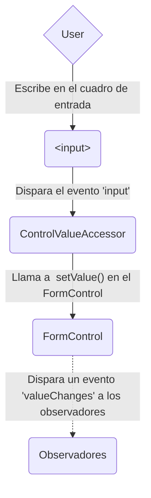
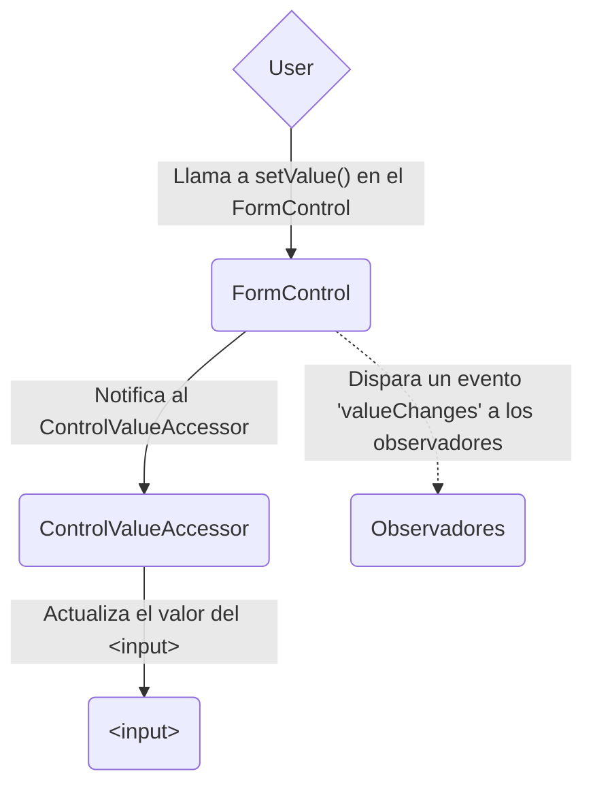
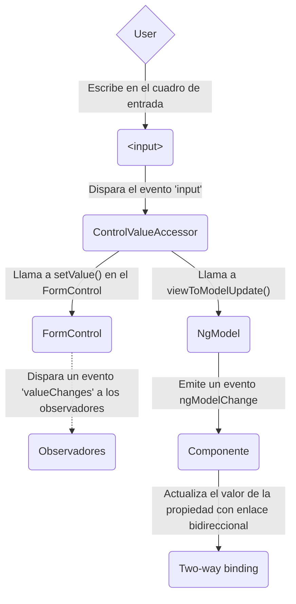
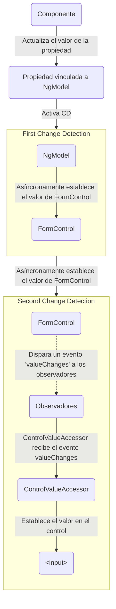

<docs-decorative-header title="Formularios en Angular" imgSrc="adev/src/assets/images/overview.svg"> <!-- markdownlint-disable-line -->
Manejar la entrada del usuario con formularios es la piedra angular de muchas aplicaciones comunes.
</docs-decorative-header>

Las aplicaciones usan formularios para permitir a los usuarios iniciar sesión, actualizar un perfil, ingresar información confidencial y realizar muchas otras tareas de entrada de datos.

Angular proporciona dos enfoques diferentes para manejar la entrada del usuario a través de formularios: reactivos y basados en plantillas.

Ambos capturan los eventos de entrada del usuario desde la vista, validan la entrada del usuario, crean un modelo de formulario y un modelo de datos para actualizar, y proporcionan una forma de rastrear los cambios.

CONSEJO: Si estás buscando los nuevos formularios experimentales Signal Forms, consulta nuestra [guía esencial de Signal Forms](/essentials/signal-forms)!

Esta guía proporciona información para ayudarte a decidir qué tipo de formulario funciona mejor para tu situación.
Introduce los bloques de construcción comunes utilizados por ambos enfoques.
También resume las diferencias clave entre los dos enfoques y demuestra esas diferencias en el contexto de configuración, flujo de datos y pruebas.

## Eligiendo un enfoque

Los formularios reactivos y los formularios basados en plantillas procesan y gestionan los datos del formulario de manera diferente. 
Cada enfoque ofrece distintas ventajas.

| Formularios                 | Detalles                                                                                                                                                                                                                                                                                                                                                                                                             |
| :-------------------- | :------------------------------------------------------------------------------------------------------------------------------------------------------------------------------------------------------------------------------------------------------------------------------------------------------------------------------------------------------------------------------------------------------------------ | 
| Formularios reactivos        | Proporcionan acceso directo y explícito al modelo de objeto del formulario subyacente. En comparación con los formularios basados en plantillas, son más robustos: son más escalables, reutilizables y fáciles de probar. Si los formularios son una parte clave de tu aplicación, o si ya estás usando patrones reactivos para construir tu aplicación, utiliza formularios reactivos.                                                                                           |
| Formularios basados en plantillas | Se basan en directivas en la plantilla para crear y manipular el modelo de objetos subyacente. Son útiles para agregar un formulario simple a una aplicación, como un formulario de suscripción a una lista de correo electrónico. Son sencillos de agregar a una aplicación, pero no escalan tan bien como los formularios reactivos. Si tienes requisitos de formulario muy básicos y una lógica que se puede gestionar únicamente en la plantilla, los formularios basados en plantillas podrían ser una buena opción. |

### Diferencias clave

La siguiente tabla resume las diferencias clave entre los formularios reactivos y los basados en plantillas.

|                                                   | Reactivos                             | Basados en plantillas                |
| :------------------------------------------------ | :----------------------------------- | :------------------------------ |
| [Configurando el modelo del formulario](#configurando-el-modelo-del-formulario) | Explícita, creada en la clase del componente | Implícita, creada por directivas |
| [Mutabilidad del modelo de datos](#mutabilidad-del-modelo-de-datos)       | Estructurado e inmutable             | No estructurado y mutable
| [Flujo de datos](#flujo-de-datos-en-formularios)                  | Síncrono                          | Asíncrono                    |
| [Validación del formulario](#validación-de-formularios)               | Funciones                            | Directivas                      |

### Escalabilidad

Si los formularios son una parte central de tu aplicación, la escalabilidad es muy importante. 
Poder reutilizar los modelos de formulario en varios componentes es crucial.

Los formularios reactivos son más escalables que los formularios basados en plantillas. 
Proporcionan acceso directo a la API de formularios subyacente y usan [flujo de datos síncrono](#flujo-de-datos-en-formularios-reactivos) entre la vista y el modelo de datos, lo que hace más fácil crear formularios a gran escala.
Los formularios reactivos requieren menos configuración para las pruebas, y las pruebas no requieren una comprensión profunda de la detección de cambios para probar correctamente las actualizaciones y validación del formulario.

Los formularios basados en plantillas se centran en escenarios simples y no son tan reutilizables. 
Abstraen la API de formularios subyacente y usan [flujo de datos asíncrono](#flujo-de-datos-en-formularios-basados-en-plantillas) entre la vista y el modelo de datos.
La abstracción de los formularios basados en plantillas también afecta las pruebas.
Las pruebas dependen profundamente de la ejecución manual de la detección de cambios para ejecutarse correctamente y requieren más configuración.

## Configurando el modelo del formulario

Tanto los formularios reactivos como los basados en plantillas rastrean los cambios de valor entre los elementos de entrada del formulario con los que los usuarios interactúan y los datos del formulario en el modelo de tu componente. 
Los dos enfoques comparten bloques de construcción subyacentes, pero difieren en cómo creas y gestionas las instancias de control de formulario comunes.

### Clases comunes en ambos tipos de formularios

Tanto los formularios reactivos como los basados en plantillas se construyen sobre las siguientes clases base.

| Clases base           | Detalles                                                                             |
| :--------------------- | :---------------------------------------------------------------------------------- |
| `FormControl`          | Rastrea el valor y el estado de validación de un control de formulario individual.               |
| `FormGroup`            | Rastrea los mismos valores y estado para una colección de controles de formulario.                |
| `FormArray`            | Rastrea los mismos valores y estado para un array de controles de formulario.                    |
| `ControlValueAccessor` | Crea un puente entre las instancias de FormControl de Angular y los elementos DOM incorporados. |

### Configuración en formularios reactivos

Con formularios reactivos, defines el modelo de formulario directamente en la clase del componente.
La directiva `[formControl]` vincula la instancia de `FormControl` explícitamente creada a un elemento de formulario específico en la vista, usando un accessor de valor interno.

El siguiente componente implementa un campo de entrada para un control único, usando formularios reactivos.
En este ejemplo, el modelo de formulario es la instancia de `FormControl`.

<docs-code language="angular-ts" path="adev/src/content/examples/forms-overview/src/app/reactive/favorite-color/favorite-color.component.ts"/>

IMPORTANTE: En formularios reactivos, el modelo de formulario es la fuente de la verdad; proporciona el valor y el estado del elemento del formulario en cualquier momento dado, a través de la directiva `[formControl]` en el elemento `<input>`.

### Configuración en formularios basados en plantillas

En formularios basados en plantillas, el modelo de formulario es implícito, en lugar de explícito.
La directiva `NgModel` crea y gestiona una instancia de `FormControl` para un elemento de formulario dado.

El siguiente componente implementa el mismo campo de entrada para un control único, usando formularios basados en plantillas.

<docs-code language="angular-ts" path="adev/src/content/examples/forms-overview/src/app/template/favorite-color/favorite-color.component.ts"/>

IMPORTANTE: En un formulario basado en plantillas, la fuente de verdad es la plantilla. La directiva `NgModel` gestiona automáticamente la instancia de `FormControl` por ti.

## Flujo de datos en formularios

Cuando una aplicación contiene un formulario, Angular debe mantener la vista sincronizada con el modelo del componente y el modelo del componente sincronizado con la vista. 
A medida que los usuarios cambian valores y hacen selecciones a través de la vista, los nuevos valores deben reflejarse en el modelo de datos. 
Del mismo modo, cuando la lógica del programa cambia valores en el modelo de datos, esos valores deben reflejarse en la vista.

Los formularios reactivos y los basados en plantillas difieren en cómo manejan el flujo de datos desde el usuario o desde cambios programáticos. 
Los siguientes diagramas ilustran ambos tipos de flujo de datos para cada tipo de formulario, utilizando el campo de entrada de color favorito definido anteriormente.

### Flujo de datos en formularios reactivos

En los formularios reactivos, cada elemento del formulario en la vista está directamente vinculado al modelo del formulario (una instancia de `FormControl`).
Las actualizaciones de la vista al modelo y del modelo a la vista son sincrónicas y no dependen de cómo se renderiza la UI.

El diagrama de vista a modelo muestra cómo fluyen los datos cuando el valor de un campo de entrada se cambia desde la vista a través de los siguientes pasos.

1. El usuario escribe un valor en el elemento de entrada, en este caso el color favorito _Azul_.
1. El elemento de entrada del formulario emite un evento "input" con el último valor.
1. El `ControlValueAccessor` que escucha eventos en el elemento de entrada del formulario inmediatamente transmite el nuevo valor a la instancia de `FormControl`.
1. La instancia de `FormControl` emite el nuevo valor a través del observable `valueChanges`.
1. Cualquier suscriptor del observable `valueChanges` recibe el nuevo valor.

El diagrama de modelo a vista muestra cómo se propaga un cambio programático al modelo a la vista a través de los siguientes pasos.

1. El usuario llama al método `favoriteColorControl.setValue()`, que actualiza el valor de `FormControl`.
1. La instancia de `FormControl` emite el nuevo valor a través del observable `valueChanges`.
1. Cualquier suscriptor del observable `valueChanges` recibe el nuevo valor.
1. El accessor de valor del control en el elemento de entrada del formulario actualiza el elemento con el nuevo valor.

### Flujo de datos en formularios basados en plantillas

En los formularios basados en plantillas, cada elemento de formulario está vinculado a una directiva que gestiona el modelo de formulario internamente.

El diagrama de vista a modelo muestra cómo fluyen los datos cuando el valor de un campo de entrada se cambia desde la vista a través de los siguientes pasos.

1. El usuario escribe _Azul_ en el elemento de entrada.
1. El elemento de entrada emite un evento "input" con el valor _Azul_.
1. El accessor de valor del control adjunto a la entrada activa el método `setValue()` en la instancia de `FormControl`.
1. La instancia de `FormControl` emite el nuevo valor a través del observable `valueChanges`.
1. Cualquier suscriptor del observable `valueChanges` recibe el nuevo valor.
1. El accessor de valor del control también llama al método `NgModel.viewToModelUpdate()` que emite un evento `ngModelChange`.
1. Debido a que la plantilla del componente usa enlace de datos bidireccional para la propiedad `favoriteColor`, la propiedad `favoriteColor` en el componente se actualiza al valor emitido por el evento `ngModelChange` \(_Azul_\).

El diagrama de modelo a vista muestra cómo fluyen los datos del modelo a la vista cuando `favoriteColor` cambia de _Azul_ a _Rojo_, a través de los siguientes pasos:

1. El valor de `favoriteColor` se actualiza en el componente.
1. Comienza la detección de cambios.
1. Durante la detección de cambios, se llama al hook del ciclo de vida `ngOnChanges` en la instancia de la directiva `NgModel` porque el valor de una de sus entradas ha cambiado.
1. El método `ngOnChanges()` encola una tarea asíncrona para establecer el valor para la instancia interna de `FormControl`.
1. Se completa la detección de cambios.
1. En el siguiente tick, se ejecuta la tarea para establecer el valor de la instancia de `FormControl`.
1. La instancia de `FormControl` emite el último valor a través del observable `valueChanges`.
1. Cualquier suscriptor del observable `valueChanges` recibe el nuevo valor.
1. El accessor de valor del control actualiza el elemento de entrada del formulario en la vista con el último valor de `favoriteColor`.

NOTA: `NgModel` activa una segunda detección de cambios para evitar errores `ExpressionChangedAfterItHasBeenChecked`, porque el cambio de valor se origina en un enlace de entrada.

### Mutabilidad del modelo de datos

El método de seguimiento de cambios juega un papel en la eficiencia de tu aplicación.

| Formularios                 | Detalles                                                                                                                                                                                                                                                                                                                                                                                                                                                                                                                                  |
| :-------------------- | :--------------------------------------------------------------------------------------------------------------------------------------------------------------------------------------------------------------------------------------------------------------------------------------------------------------------------------------------------------------------------------------------------------------------------------------------------------------------------------------------------------------------------------------- |
| Formularios reactivos        | Mantienen el modelo de datos puro proporcionándolo como una estructura de datos inmutable. Cada vez que se dispara un cambio en el modelo de datos, la instancia de `FormControl` devuelve un nuevo modelo de datos en lugar de actualizar el modelo de datos existente. Esto te da la capacidad de rastrear cambios únicos en el modelo de datos a través del observable del control. La detección de cambios es más eficiente porque solo necesita actualizarse con cambios únicos. Dado que las actualizaciones de datos siguen patrones reactivos, puedes integrar operadores observables para transformar los datos. |
| Formularios basados en plantillas | Se basan en la `mutabilidad` con enlace de datos bidireccional para actualizar el modelo de datos en el componente a medida que se realizan cambios en la plantilla. Debido a que no hay cambios únicos que rastrear en el modelo de datos al usar el enlace de datos bidireccional, la detección de cambios es menos eficiente para determinar cuándo se requieren actualizaciones.                                                                                                                                                                                                |

La diferencia se demuestra en los ejemplos anteriores que usan el elemento de entrada de color favorito.

- Con formularios reactivos, la **instancia de `FormControl`** siempre devuelve un nuevo valor cuando se actualiza el valor del control
- Con formularios basados en plantillas, la **propiedad de color favorito** siempre se modifica a su nuevo valor

## Validación de formularios

La validación es una parte integral de la gestión de cualquier conjunto de formularios. 
Ya sea que estés verificando campos obligatorios o consultando una API externa para un nombre de usuario existente, Angular proporciona un conjunto de validadores incorporados, así como la capacidad de crear validadores personalizados.

| Formularios                 | Detalles                                                                                                      |
| :-------------------- | :----------------------------------------------------------------------------------------------------------- |
| Formularios reactivos        |  Definen validadores personalizados como **funciones** que reciben un control para validar                                 |
| Formularios basados en plantillas | Vinculados a **directivas** de plantilla, y deben proporcionar directivas de validador personalizadas que envuelvan funciones de validación |

Para más información, consulta [Validación de Formularios](guide/forms/form-validation#validating-input-in-reactive-forms).

## Pruebas

Las pruebas juegan un papel importante en aplicaciones complejas. 
Una estrategia de prueba más simple es útil al validar que tus formularios funcionan correctamente. 
Los formularios reactivos y los basados en plantillas tienen diferentes niveles de dependencia en la representación de la UI para realizar aserciones basadas en los cambios de los controles y campos del formulario. 
Los siguientes ejemplos demuestran el proceso de probar formularios con formularios reactivos y basados en plantillas.

### Probando formularios reactivos

Los formularios reactivos proporcionan una estrategia de pruebas relativamente sencilla porque proporcionan acceso síncrono a los modelos de formulario y datos, y pueden probarse sin renderizar la UI.
En estas pruebas, el estado y los datos se consultan y manipulan a través del control sin interactuar con el ciclo de detección de cambios.

Las siguientes pruebas usan los componentes de color favorito de ejemplos anteriores para verificar los flujos de datos de vista a modelo y modelo a vista para un formulario reactivo.

<!--todo: make consistent with other topics -->

#### Verificando flujo de datos de vista a modelo

El primer ejemplo realiza los siguientes pasos para verificar el flujo de datos de vista a modelo.

1. Consultar la vista para el elemento de entrada del formulario y crear un evento "input" personalizado para la prueba.
1. Establecer el nuevo valor para la entrada como _Rojo_ y despachar el evento "input" en el elemento de entrada del formulario.
1. Verificar que el valor de `favoriteColorControl` del componente coincide con el valor de la entrada.

<docs-code header="Prueba de color favorito - vista a modelo" path="adev/src/content/examples/forms-overview/src/app/reactive/favorite-color/favorite-color.component.spec.ts" visibleRegion="view-to-model"/>

El siguiente ejemplo realiza los siguientes pasos para verificar el flujo de datos de modelo a vista.

1. Usar el `favoriteColorControl`, una instancia de `FormControl`, para establecer el nuevo valor.
1. Consultar la vista para el elemento de entrada del formulario.
1. Verificar que el nuevo valor establecido en el control coincide con el valor en la entrada.

<docs-code header="Prueba de color favorito - vista a modelo" path="adev/src/content/examples/forms-overview/src/app/reactive/favorite-color/favorite-color.component.spec.ts" visibleRegion="model-to-view"/>

### Probando formularios basados en plantillas

Escribir pruebas con formularios basados en plantillas requiere un conocimiento detallado del proceso de detección de cambios y una comprensión de cómo las directivas se ejecutan en cada ciclo para asegurar que los elementos se consulten, prueben o cambien en el momento correcto.

Las siguientes pruebas usan los componentes de color favorito mencionados anteriormente para verificar los flujos de datos de vista a modelo y modelo a vista para un formulario basado en plantillas.

La siguiente prueba verifica el flujo de datos de vista a modelo.

<docs-code header="Prueba de color favorito - vista a modelo" path="adev/src/content/examples/forms-overview/src/app/template/favorite-color/favorite-color.component.spec.ts" visibleRegion="view-to-model"/>

Aquí están los pasos realizados en la prueba de vista a modelo.

1. Consultar la vista para el elemento de entrada del formulario y crear un evento "input" personalizado para la prueba.
1. Establecer el nuevo valor para la entrada como _Rojo_ y despachar el evento "input" en el elemento de entrada del formulario.
1. Ejecutar la detección de cambios a través del fixture de prueba.
1. Verificar que el valor de la propiedad `favoriteColor` del componente coincide con el valor de la entrada.

La siguiente prueba verifica el flujo de datos de modelo a vista.

<docs-code header="Prueba de color favorito - vista a modelo" path="adev/src/content/examples/forms-overview/src/app/template/favorite-color/favorite-color.component.spec.ts" visibleRegion="model-to-view"/>

Aquí están los pasos realizados en la prueba de modelo a vista.

1. Usar la instancia del componente para establecer el valor de la propiedad `favoriteColor`.
1. Ejecutar la detección de cambios a través del fixture de prueba.
1. Usar el método `tick()` para simular el paso del tiempo dentro de la tarea `fakeAsync()`.
1. Consultar la vista para el elemento de entrada del formulario.
1. Verificar que el valor de entrada coincide con el valor de la propiedad `favoriteColor` en la instancia del componente.

## Próximos pasos

Para aprender más sobre formularios reactivos, consulta las siguientes guías:

<docs-pill-row>
  <docs-pill href="guide/forms/reactive-forms" title="Formularios reactivos"/>
  <docs-pill href="guide/forms/form-validation#validating-input-in-reactive-forms" title="Validación de formularios"/>
  <docs-pill href="guide/forms/dynamic-forms" title="Formularios dinámicos"/>
</docs-pill-row>

Para aprender más sobre formularios basados en plantillas, consulta las siguientes guías:

<docs-pill-row>
  <docs-pill href="guide/forms/template-driven-forms" title="Tutorial de formularios basados en plantillas" />
  <docs-pill href="guide/forms/form-validation#validating-input-in-template-driven-forms" title="Validación de formularios" />
  <docs-pill href="api/forms/NgForm" title="Referencia de la API de la directiva NgForm" />
</docs-pill-row>
