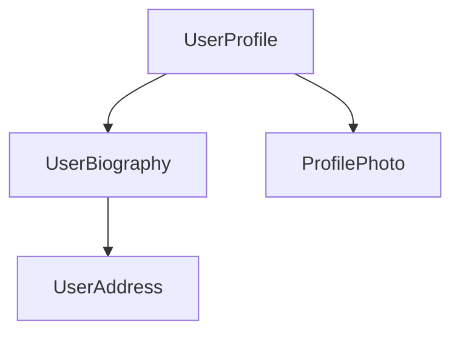

<docs-decorative-header title="Componentes" imgSrc="adev/src/assets/images/components.svg"> <!-- markdownlint-disable-line -->
El elemento fundamental para crear aplicaciones en Angular.
</docs-decorative-header>

Los componentes son los bloques principales de construcción de las aplicaciones Angular. Cada componente representa una parte de una página web más grande. Organizar una aplicación en componentes ayuda a proporcionar estructura a tu proyecto, separando claramente el código en partes específicas que son fáciles de mantener y crecer con el tiempo.

## Definir un Componente

Cada componente tiene algunas partes principales:

1. Un [decorador](https://www.typescriptlang.org/docs/handbook/decorators.html) `@Component` que contiene alguna configuración utilizada por Angular.
2. Una plantilla HTML que controla lo que se renderiza en el DOM.
3. Un [selector CSS ](https://developer.mozilla.org/en-US/docs/Learn/CSS/Building_blocks/Selectors) que define cómo se usa el componente en HTML.
4. Una clase TypeScript con comportamientos, como manejar la entrada del usuario o hacer solicitudes a un servidor..

Aquí hay un ejemplo simplificado de un componente `UserProfile`.

```angular-ts
// user-profile.ts
@Component({
  selector: 'user-profile',
  template: `
    <h1>Perfil de usuario</h1>
    <p>Esta es la página del perfil de usuario</p>
  `,
})
export class UserProfile { /* Tu código del componente va aquí */ }
```

El decorador `@Component` también acepta opcionalmente una propiedad `styles` para cualquier CSS que quieras aplicar a tu plantilla:

```angular-ts
// user-profile.ts
@Component({
  selector: 'user-profile',
  template: `
    <h1>Perfil de usuario</h1>
    <p>Esta es la página del perfil de usuario</p>
  `,
  styles: `h1 { font-size: 3em; } `,
})
export class UserProfile { /* Tu código del componente va aquí */ }
```

### Separar HTML y CSS en archivos

Puedes definir el HTML y CSS de un componente en archivos separados usando `templateUrl` y `styleUrl`:

```angular-ts
// user-profile.ts
@Component({
  selector: 'user-profile',
  templateUrl: 'user-profile.html',
  styleUrl: 'user-profile.css',
})
export class UserProfile {
  // El comportamiento del componente se define aquí
}
```

```angular-html
<!-- user-profile.html -->
<h1>Perfil del usuario</h1>
<p>Esta es la página del perfil de usuario</p>
```

```css
/* user-profile.css */
li {
  color: red;
  font-weight: 300;
}
```

## Usar un Component

Construyes una aplicación componiendo múltiples componentes juntos. Por ejemplo, si estás creando una página de perfil de usuario, podrías dividir la página en varios componentes como este:


Aquí, el componente `UserProfile` utiliza varios otros componentes para generar la página final.

Para importar y usar un componente, debes:

1. En el archivo TypeScript de tu componente, agregar una declaración `import` para el componente que deseas usar.
2. En el decorador `@Component`, agregar el componente que deseas usar al arreglo `imports`.
3. En la plantilla de tu componente, agregar un elemento que coincida con el selector del componente que deseas usar.

Aquí tienes un ejemplo del componente `UserProfile` que importa y utiliza el componente `ProfilePhoto`:

```angular-ts
// user-profile.ts
import {ProfilePhoto} from 'profile-photo.ts';

@Component({
  selector: 'user-profile',
  imports: [ProfilePhoto],
  template: `
    <h1>Perfil del usuario</h1>
    <profile-photo />
    <p>Esta es la página del perfil de usuario</p>
  `,
})
export class UserProfile {
  // El comportamiento del componente se define aquí
}
```

SUGERENCIA: ¿Quieres saber más sobre los componentes en Angular? [Consulta la guía detallada de componentes](guide/components) para todos todos los detalles. 

## Siguiente Paso

Ahora que sabe cómo funcionan los componentes en Angular, es hora de aprender cómo agregamos y gestionamos los datos dinámicos en nuestra aplicación.

<docs-pill-row>
  <docs-pill title="Reactividad con Signals" href="essentials/signals" />
  <docs-pill title="Guía detallada de componentes" href="guide/components" />
</docs-pill-row>
