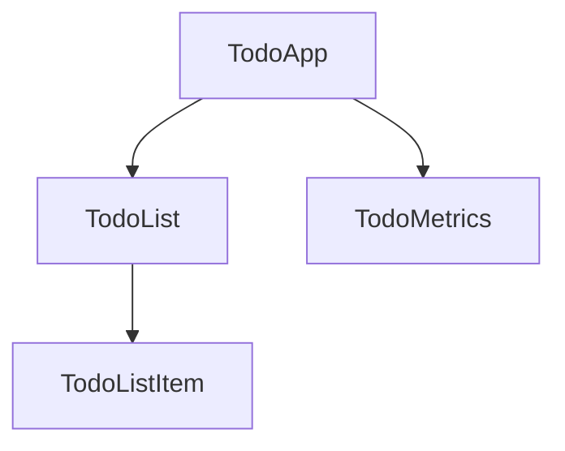

<docs-decorative-header title="Componentes" imgSrc="adev/src/assets/images/components.svg"> <!-- markdownlint-disable-line -->
El elemento fundamental para crear aplicaciones en Angular.
</docs-decorative-header>

Los componentes proporcionan la estructura para organizar su proyecto en partes fáciles de entender con responsabilidades claras para que su código sea mantenible y escalable.

Aquí hay un ejemplo de cómo una aplicación de Tareas Pendientes (ToDo en inglés)  se podría dividir en un árbol de componentes.


```mermaid
flowchart TD
    A[TodoApp]-->B
    A-->C
    B[TodoList]-->D
    C[TodoMetrics]
    D[TodoListItem]
```

En esta guía, veremos cómo crear y usar componentes en Angular.

## Definiendo un Componente

Cada componente tiene las siguientes propiedades principales:

1. Un [decorador](https://www.typescriptlang.org/docs/handbook/decorators.html) `@Component`que contiene alguna configuración
2. Una plantilla HTML que controla lo que se renderiza en el DOM
3. Un [selector CSS ](https://developer.mozilla.org/en-US/docs/Learn/CSS/Building_blocks/Selectors) que define cómo se usa el componente en HTML
4. Una clase de TypeScript con comportamientos como gestión de estado, manejo de entrada de usuario o recuperación de datos de un servidor.

Aquí hay un ejemplo simplificado de un componente TodoListItem.

```ts
// todo-list-item.component.ts
@Component({
  selector: 'todo-list-item',
  template: `
    <li>(TODO) Lea la guía de Angular Essentials</li>
  `,
})
export class TodoListItem {
  /* El comportamiento de los componentes se define aquí */
}
```

Otros metadatos comunes que también verás en los componentes incluyen:

- `standalone: true` — El enfoque recomendado para simplificar la experiencia de creación de componentes
- `styles` — Una cadena o matriz de cadenas que contiene cualquier estilo CSS que desee aplicar al componente

Sabiendo esto, aquí hay una versión actualizada de nuestro componente `TodoListItem`.

```ts
// todo-list-item.component.ts
@Component({
  standalone: true,
  selector: 'todo-list-item',
  template: `
    <li>(TODO) Lea la guía de Angular Essentials</li>
  `,
  styles: `
    li {
      color: red;
      font-weight: 300;
    }
  `,
})
export class TodoListItem {
  /* El comportamiento de los componentes se define aquí */
}
```

### Separando HTML y CSS en archivos separados

Para los equipos que prefieren administrar su HTML y/o CSS en archivos separados, Angular proporciona dos propiedades adicionales: `templateUrl` y `styleUrl`.

Usando el componente `TodoListItem` anterior, el enfoque alternativo se ve así:

```ts
// todo-list-item.component.ts
@Component({
  standalone: true,
  selector: 'todo-list-item',
  templateUrl: './todo-list-item.component.html',
  styleUrl: './todo-list-item.component.css',
})
export class TodoListItem {
  /* El comportamiento de los componentes se define aquí */
}
```

```html
<!-- todo-list-item.component.html -->
<li>(TODO) Lea la guía de Angular Essentials</li>
```

```css
// todo-list-item.component.css
li {
  color: red;
  font-weight: 300;
}
```

## Usando un Component

Una ventaja de la arquitectura de componentes es que su aplicación es modular. En otras palabras, los componentes se pueden usar en otros componentes.

Para usar un componente, necesitas:

1. Importar el componente en el archivo
2. Añadirlo a la matriz de `importaciones` del componente
3. Utilice el selector del componente en la `plantilla`

Aquí hay un ejemplo del componente `TodoList` importando el componente `TodoListItem` de antes:

```ts
// todo-list.component.ts
import {TodoListItem} from './todo-list-item.component.ts';

@Component({
  standalone: true,
  imports: [TodoListItem],
  template: `
    <ul>
      <todo-list-item></todo-list-item>
    </ul>
  `,
})
export class TodoList {}
```

## Siguiente Paso

Ahora que sabe cómo funcionan los componentes en Angular, es hora de aprender cómo agregamos y gestionamos los datos dinámicos en nuestra aplicación.

<docs-pill-row>
  <docs-pill title="Gestión de Datos Dinámicos" href="essentials/managing-dynamic-data" />
</docs-pill-row>
