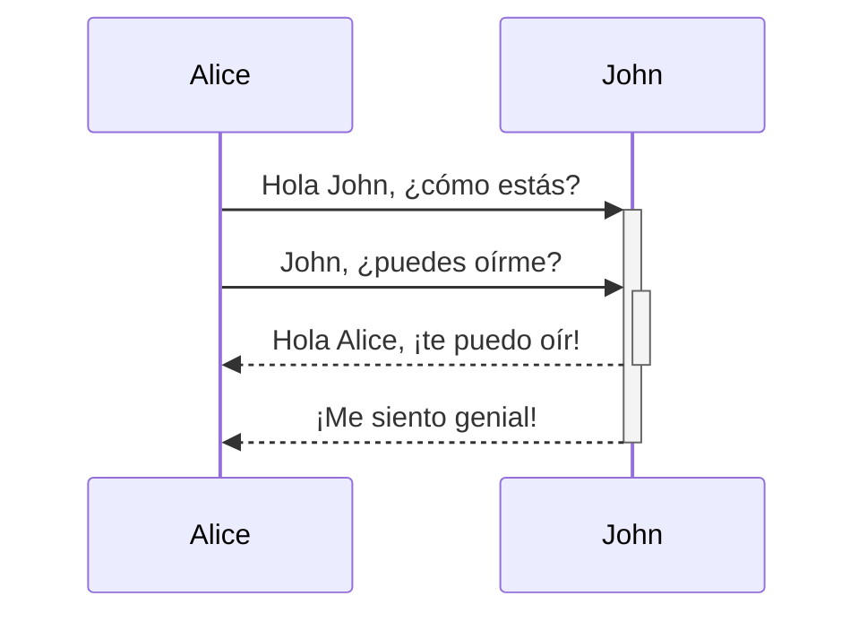
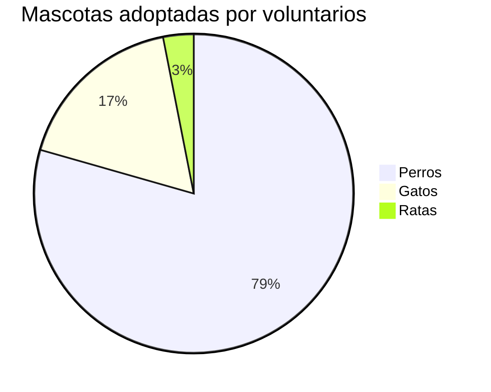

<docs-decorative-header title="Muestrario" imgSrc="adev/src/assets/images/components.svg"> <!-- markdownlint-disable-line -->
Esta es una lista visual de todos los componentes y estilos personalizados para Angular.dev.
</docs-decorative-header>

Como sistema de diseño, esta página contiene guías visuales y de redacción en Markdown para:

- Elementos personalizados de la documentación de Angular: [`docs-card`](#tarjetas), [`docs-callout`](#callouts), [`docs-pill`](#pills) y [`docs-steps`](#flujo-de-trabajo)
- Elementos de texto personalizados: [alertas](#alertas)
- Ejemplos de código: [`docs-code`](#código)
- Elementos de estilo Markdown integrados: enlaces, listas, [encabezados](#encabezados-h2), [líneas horizontales](#divisor-de-línea-horizontal)
- ¡y más!

Prepárate para:

1. Escribir...
2. excelente...
3. documentación!

## Encabezados (h2)

### Encabezados más pequeños (h3)

#### Aún más pequeños (h4)

##### Todavía más pequeños (h5)

###### ¡Los más pequeños! (h6)

## Tarjetas

<docs-card-container>
  <docs-card title="¿Qué es Angular?" link="Visión general de la plataforma" href="tutorials/first-app">
    Lorem ipsum dolor sit amet, consectetur adipiscing elit. Nullam ornare ligula nisi
  </docs-card>
  <docs-card title="Segunda tarjeta" link="Pruébalo ahora" href="essentials/what-is-angular">
    Lorem ipsum dolor sit amet, consectetur adipiscing elit. Nullam ornare ligula nisi
  </docs-card>
    <docs-card title="Tarjeta sin enlace">
    Lorem ipsum dolor sit amet, consectetur adipiscing elit. Nullam ornare ligula nisi
  </docs-card>
</docs-card-container>

### Atributos de `<docs-card>`

| Atributos                           | Detalles                                                        |
| :---------------------------------- | :-------------------------------------------------------------- |
| `<docs-card-container>`             | Todas las tarjetas deben estar anidadas dentro de un contenedor |
| `title`                             | Título de la tarjeta                                            |
| contenidos del cuerpo de la tarjeta | Cualquier cosa entre `<docs-card>` y `</docs-card>`             |
| `link`                              | (Opcional) Texto del enlace de llamada a la acción              |
| `href`                              | (Opcional) Href del enlace de llamada a la acción               |

## Callouts

<docs-callout title="Título de un callout que es útil">
  Lorem ipsum dolor sit amet, consectetur adipiscing elit. Nulla luctus metus blandit semper faucibus. Sed blandit diam quis tellus maximus, ac scelerisque ex egestas. Ut euismod lobortis mauris pretium iaculis. Quisque ullamcorper, elit ut lacinia blandit, magna sem finibus urna, vel suscipit tortor dolor id risus.
</docs-callout>

<docs-callout critical title="Título de un callout que es crítico">
  Lorem ipsum dolor sit amet, consectetur adipiscing elit. Nulla luctus metus blandit semper faucibus. Sed blandit diam quis tellus maximus, ac scelerisque ex egestas. Ut euismod lobortis mauris pretium iaculis. Quisque ullamcorper, elit ut lacinia blandit, magna sem finibus urna, vel suscipit tortor dolor id risus.
</docs-callout>

<docs-callout important title="Título de un callout que es importante">
  Lorem ipsum dolor sit amet, consectetur adipiscing elit. Nulla luctus metus blandit semper faucibus. Sed blandit diam quis tellus maximus, ac scelerisque ex egestas. Ut euismod lobortis mauris pretium iaculis. Quisque ullamcorper, elit ut lacinia blandit, magna sem finibus urna, vel suscipit tortor dolor id risus.
</docs-callout>

### Atributos de `<docs-callout>`

| Atributos                                        | Detalles                                                           |
| :----------------------------------------------- | :----------------------------------------------------------------- |
| `title`                                          | Título del callout                                                 |
| contenidos del cuerpo de la tarjeta              | Cualquier cosa entre `<docs-callout>` y `</docs-callout>`          |
| `helpful` (default) \| `critical` \| `important` | (Opcional) Añade estilos e iconos basados en el nivel de severidad |

## Pills

Las filas de pills son útiles como una especie de navegación con enlaces a recursos útiles.

<docs-pill-row id=pill-row>
  <docs-pill href="#pill-row" title="Enlace"/>
  <docs-pill href="#pill-row" title="Enlace"/>
  <docs-pill href="#pill-row" title="Enlace"/>
  <docs-pill href="#pill-row" title="Enlace"/>
  <docs-pill href="#pill-row" title="Enlace"/>
  <docs-pill href="#pill-row" title="Enlace"/>
</docs-pill-row>

### Atributos de `<docs-pill>`

| Atributos        | Detalles                                                         |
| :--------------- | :--------------------------------------------------------------- |
| `<docs-pill-row` | Todas las pills deben estar anidadas dentro de una fila de pills |
| `title`          | Texto del pill                                                   |
| `href`           | Href del pill                                                    |

Las pills también pueden usarse en línea por sí mismas, pero aún no hemos desarrollado eso.

## Alertas

Las alertas son solo párrafos especiales. Son útiles para resaltar (no confundir con call-out) algo que es un poco más urgente. Ganan tamaño de fuente según el contexto y están disponibles en muchos niveles. Trata de no usar alertas para renderizar demasiado contenido, sino más bien para mejorar y llamar la atención sobre el contenido circundante.

Estila alertas comenzando en una nueva línea en Markdown usando el formato `NIVEL_DE_SEVERIDAD` + `:` + `TEXTO_DE_ALERTA`.

NOTA: Usa Note para información auxiliar/adicional que no es _esencial_ para el texto principal.

CONSEJO: Usa Tip para resaltar una tarea/acción específica que los usuarios pueden realizar, o un hecho que juega directamente en una tarea/acción.

TODO: Usa TODO para documentación incompleta que planeas expandir pronto. También puedes asignar el TODO, por ejemplo, TODO(emmatwersky): Texto.

PREGUNTA: Usa Question para plantear una pregunta al lector, algo así como un mini-quiz que deberían poder responder.

RESUMEN: Usa Summary para proporcionar una sinopsis de dos o tres oraciones del contenido de la página o sección, para que los lectores puedan averiguar si este es el lugar correcto para ellos.

TLDR: Usa TL;DR (o TLDR) si puedes proporcionar la información esencial sobre una página o sección en una o dos oraciones. Por ejemplo, TLDR: Ruibarbo es un gato.

CRÍTICO: Usa Critical para advertir sobre cosas potencialmente malas o alertar al lector de que debe tener cuidado antes de hacer algo. Por ejemplo, Advertencia: Ejecutar `rm` con la opción `-f` eliminará archivos o directorios protegidos contra escritura sin preguntarte.

IMPORTANTE: Usa Important para información que es crucial para comprender el texto o para completar alguna tarea.

ÚTIL: Usa Best practice para resaltar prácticas que se sabe que son exitosas o mejores que las alternativas.

NOTA: ¡Atención `desarrolladores`! ¡Las alertas _pueden_ tener un [enlace](#alertas) y otros estilos anidados (pero trata de **usar esto con moderación**)!.

## Código

Puedes mostrar `código` usando las triples comillas invertidas integradas:

```ts
código de ejemplo
```

O usando el elemento `<docs-code>`.

<docs-code header="Tu primer ejemplo" language="ts" linenums>
import { Component } from '@angular/core';

@Component({
selector: 'example-code',
template: '<h1>¡Hola Mundo!</h1>',
})
export class ComponentOverviewComponent {}
</docs-code>

### Estilizando el ejemplo

Aquí tienes un ejemplo de código completamente estilizado:

<docs-code
  path="adev/src/content/examples/hello-world/src/app/app.component-old.ts"
  header="Un ejemplo de código estilizado"
  language='ts'
  linenums
  highlight="[[3,7], 9]"
  preview
  visibleLines="[3,10]">
</docs-code>

También tenemos estilos para la terminal, simplemente establece el lenguaje como `shell`:

```shell
npm install @angular/material --save
```

#### Atributos de `<docs-code>`

| Atributos       | Tipo                 | Detalles                                              |
| :-------------- | :------------------- | :---------------------------------------------------- |
| code            | `string`             | Cualquier cosa entre etiquetas se trata como código   |
| `path`          | `string`             | Ruta al ejemplo de código (raíz: `content/examples/`) |
| `header`        | `string`             | Título del ejemplo (predeterminado: `file-name`)      |
| `language`      | `string`             | lenguaje del código                                   |
| `linenums`      | `boolean`            | (Falso) muestra números de línea                      |
| `highlight`     | `string of number[]` | líneas resaltadas                                     |
| `diff`          | `string`             | ruta al código modificado                             |
| `visibleLines`  | `string of number[]` | rango de líneas para el modo colapsado                |
| `visibleRegion` | `string`             | **DEPRECADO** POR `visibleLines`                      |
| `preview`       | `boolean`            | (Falso) muestra vista previa                          |
| `hideCode`      | `boolean`            | (Falso) Si colapsar el ejemplo de código por defecto. |

### Ejemplos de múltiples archivos

Puedes crear ejemplos de múltiples archivos envolviendo los ejemplos dentro de un `<docs-code-multifile>`.

<docs-code-multifile
  path="adev/src/content/examples/hello-world/src/app/app.component.ts"
  preview>
<docs-code
    path="adev/src/content/examples/hello-world/src/app/app.component.html"
    highlight="[1]"
    linenums/>
<docs-code
    path="adev/src/content/examples/hello-world/src/app/app.component.css" />
</docs-code-multifile>

#### Atributos de `<docs-code-multifile>`

| Atributos     | Tipo      | Detalles                                                     |
| :------------ | :-------- | :----------------------------------------------------------- |
| body contents | `string`  | pestañas anidadas de ejemplos `docs-code`                    |
| `path`        | `string`  | Ruta al ejemplo de código para vista previa y enlace externo |
| `preview`     | `boolean` | (Falso) muestra vista previa                                 |
| `hideCode`    | `boolean` | (Falso) Si colapsar el ejemplo de código por defecto.        |

### Añadiendo `preview` a tu ejemplo de código

Añadir la bandera `preview` construye un ejemplo en ejecución del código debajo del fragmento de código. Esto también añade automáticamente un botón para abrir el ejemplo en ejecución en Stackblitz.

NOTA: `preview` solo funciona con standalone.

### Estilizando vistas previas de ejemplo con Tailwind CSS

Las clases de utilidad de Tailwind se pueden usar dentro de los ejemplos de código.

<docs-code-multifile
  path="adev/src/content/examples/hello-world/src/app/tailwind-app.component.ts"
  preview>
<docs-code path="adev/src/content/examples/hello-world/src/app/tailwind-app.component.html" />
<docs-code path="adev/src/content/examples/hello-world/src/app/tailwind-app.component.ts" />
</docs-code-multifile>

## Pestañas

<docs-tab-group>
  <docs-tab label="Ejemplo de Código">
    <docs-code-multifile
      path="adev/src/content/examples/hello-world/src/app/tailwind-app.component.ts"
      hideCode="true"
      preview>
    <docs-code path="adev/src/content/examples/hello-world/src/app/tailwind-app.component.html" />
    <docs-code path="adev/src/content/examples/hello-world/src/app/tailwind-app.component.ts" />
    </docs-code-multifile>
  </docs-tab>
  <docs-tab label="Algún Texto">
    Lorem ipsum dolor sit amet, consectetur adipiscing elit. Nulla luctus metus blandit semper faucibus. Sed blandit diam quis tellus maximus, ac scelerisque ex egestas. Ut euismod lobortis mauris pretium iaculis. Quisque ullamcorper, elit ut lacinia blandit, magna sem finibus urna, vel suscipit tortor dolor id risus.
  </docs-tab>
</docs-tab-group>

## Flujo de trabajo

Estila pasos numerados usando `<docs-step>`. La numeración se crea usando CSS (¡práctico!).

### Atributos de `<docs-workflow>` y `<docs-step>`

| Atributos          | Detalles                                                           |
| :----------------- | :----------------------------------------------------------------- |
| `<docs-workflow>`  | Todos los pasos deben estar anidados dentro de un flujo de trabajo |
| `title`            | Título del paso                                                    |
| step body contents | Cualquier cosa entre `<docs-step>` y `</docs-step>`                |

Los pasos deben comenzar en una nueva línea, y pueden contener `docs-code`s y otros elementos y estilos anidados.

<docs-workflow>

<docs-step title="Instalar la CLI de Angular">
  Usas la CLI de Angular para crear proyectos, generar código de aplicación y biblioteca, y realizar una variedad de tareas de desarrollo continuas como pruebas, empaquetado y despliegue.

Para instalar la CLI de Angular, abre una ventana de terminal y ejecuta el siguiente comando:

```shell
npm install -g @angular/cli
```

</docs-step>

<docs-step title="Crear un espacio de trabajo y una aplicación inicial">
  Desarrollas aplicaciones en el contexto de un espacio de trabajo de Angular.

Para crear un nuevo espacio de trabajo y una aplicación inicial:

- Ejecuta el comando CLI `ng new` y proporciona el nombre `my-app`, como se muestra aquí:

  ```shell
  ng new my-app
  ```

- El comando ng new te pide información sobre las características a incluir en la aplicación inicial. Acepta los valores predeterminados presionando la tecla Enter o Return.

  La CLI de Angular instala los paquetes npm de Angular necesarios y otras dependencias. Esto puede tardar unos minutos.

  La CLI crea un nuevo espacio de trabajo y una aplicación simple de Bienvenida, lista para ejecutarse.
  </docs-step>

<docs-step title="Ejecutar la aplicación">
  La CLI de Angular incluye un servidor, para que compiles y sirvas tu aplicación localmente.

1. Navega a la carpeta del espacio de trabajo, como `my-app`.
2. Ejecuta el siguiente comando:

   ```shell
   cd my-app
   ng serve --open
   ```

   El comando `ng serve` lanza el servidor, observa tus archivos y recompila la aplicación a medida que haces cambios en esos archivos.

   La opción `--open` (o simplemente `-o`) abre automáticamente tu navegador en <http://localhost:4200/>.
   Si tu instalación y configuración tuvieron éxito, deberías ver una página similar a la siguiente.
   </docs-step>

<docs-step title="Paso final">
  ¡Esos son todos los componentes de la documentación! Ahora:

  <docs-pill-row>
    <docs-pill href="#pill-row" title="Ve"/>
    <docs-pill href="#pill-row" title="escribe"/>
    <docs-pill href="#pill-row" title="excelente"/>
    <docs-pill href="#pill-row" title="documentación!"/>
  </docs-pill-row>
</docs-step>

</docs-workflow>

## Imágenes y video

Puedes añadir imágenes usando la imagen Markdown semántica:


### Añade `#small` y `#medium` para cambiar el tamaño de la imagen


## Añadir atributos usando la sintaxis de llaves


Los videos incrustados se crean con `docs-video` y solo necesitan un `src` y `alt`:

<docs-video src="https://www.youtube.com/embed/O47uUnJjbJc" alt=""/>

## Gráficos y Diagramas

Escribe diagramas y gráficos usando [Mermaid](http://mermaid.js.org/) estableciendo el lenguaje de código a `mermaid`, todo el tema está integrado.






## Divisor de línea horizontal

Esto se puede usar para separar secciones de la página, como estamos a punto de hacer a continuación. Estos estilos se añadirán por defecto, no se necesita nada personalizado.

<hr/>

¡El fin!
